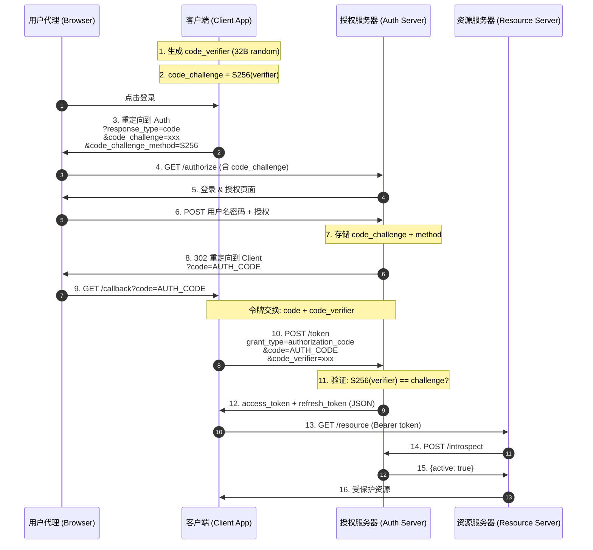

# Authorization Code + PKCE Flow - Status

## 概述

PKCE（Proof Key for Code Exchange，RFC 7636）是授权码模式的增强扩展，用于**防止授权码拦截攻击**。客户端在授权请求中发送 `code_challenge`，在令牌交换时发送 `code_verifier`，授权服务器验证二者匹配后才签发令牌。即使攻击者截获了授权码，没有 `code_verifier` 也无法换取令牌。

**PKCE 最初是为原生应用（Public Client）设计，但 RFC 建议所有 OAuth 客户端都使用 PKCE，包括 Web 应用。**

## PKCE 的核心改进

| 特性 | 标准授权码模式 | 授权码 + PKCE |
|------|--------------|---------------|
| 授权码拦截保护 | 依赖 client_secret | **加密绑定**到 code_verifier |
| 原生应用支持 | 不安全（无法保密 secret） | **安全**（无 secret 要求） |
| 防降级攻击 | 无 | 如果有 code_challenge 则强制验证 code_verifier |
| `code_challenge` | 无 | S256(verifier) 或 verifier 本身 |
| `code_verifier` | 无 | 43-128 字符的加密随机字符串 |

## PKCE 完整流程



## 攻击场景对比

### 无 PKCE：授权码拦截攻击

```
用户 → 授权服务器 (获取授权码)
攻击者 ← 截获授权码 ← 重定向到恶意应用
攻击者 → 授权服务器 (用截获的授权码换 token) → 成功！
```

### 有 PKCE：授权码拦截被阻止

```
用户 → 授权服务器 (发送 code_challenge)
攻击者 ← 截获授权码 ← 重定向到恶意应用
攻击者 → 授权服务器 (用授权码，但没有 code_verifier) → 失败！
```

## 关键安全特性

1. **PKCE (S256)** — code_challenge 使用 SHA-256 哈希，不暴露 code_verifier 原文
2. **防降级攻击** — 如果授权请求有 code_challenge，令牌请求**必须**有 code_verifier（否则拒绝）
3. **一次性 verifier** — 每次授权生成新的 code_verifier，交换后立即清空
4. **State 参数** — CSRF 防护
5. **授权码重用检测** + 令牌撤销
6. **Refresh Token 轮换** + 重放检测

## 如何运行

```bash
# Terminal 1 - Authorization Server
go run ./cmd/Authorization-Code-PKCE/auth-server/

# Terminal 2 - Resource Server
go run ./cmd/Authorization-Code-PKCE/resource-server/

# Terminal 3 - Client Application
go run ./cmd/Authorization-Code-PKCE/client/
```

打开 http://localhost:8080 访问。

## 类型定义

### PKCE 参数

| 参数 | 位置 | 描述 |
|------|------|------|
| `code_challenge` | 授权请求 | `S256(code_verifier)` 或 `plain` 原文 |
| `code_challenge_method` | 授权请求 | `"S256"`（推荐）或 `"plain"` |
| `code_verifier` | 令牌请求 | 43-128 字符的加密随机字符串 |

### Authorization Request (含 PKCE)

```
GET /authorize?response_type=code
  &client_id=oauth-client-1
  &redirect_uri=http://localhost:8080/callback
  &state=xyz
  &code_challenge=E9Melhoa2OwvFrEMTJguCHaoeK1t8URWbuGJSstw-cM
  &code_challenge_method=S256
```

### Access Token Request (含 PKCE)

```
POST /token
Content-Type: application/x-www-form-urlencoded

grant_type=authorization_code
&code=SplxlOBeZQQYbYS6WxSbIA
&redirect_uri=https://client.example.com/cb
&client_id=oauth-client-1
&client_secret=oauth-client-secret-1
&code_verifier=dBjftJeZ4CVP-mB92K27uhbUJU1p1r_wW1gFWFOEjXk
```

### Token Response

```json
{
  "access_token": "2YotnFZFEjr1zCsicMWpAA",
  "token_type": "Bearer",
  "expires_in": 3600,
  "refresh_token": "tGzv3JOkF0XG5Qx2TlKWIA"
}
```

### Introspect Response

```json
{
  "active": true,
  "client_id": "oauth-client-1",
  "username": "demo_user",
  "exp": 1718000000
}
```
