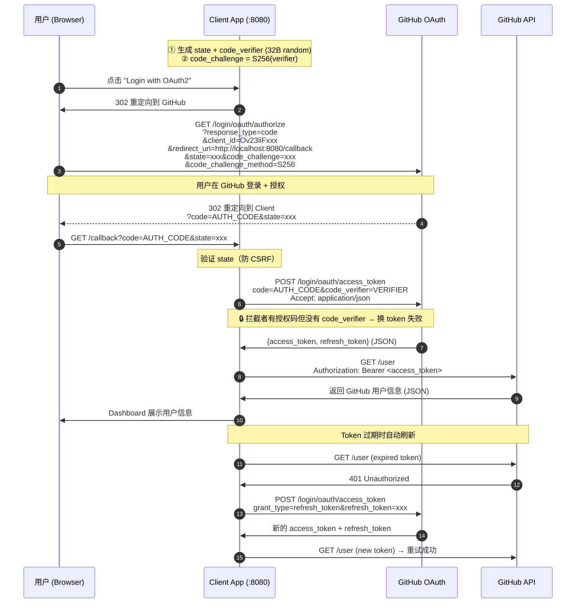

# Authorization Code + PKCE (GitHub) - Status

## 概述

Authorization Code + PKCE（Proof Key for Code Exchange，RFC 7636）是 OAuth 2.0 授权码模式的增强版。客户端直接对接 **GitHub OAuth 端点**，通过 `code_verifier` + `code_challenge`（S256）防止授权码被拦截后冒用。

**关键区别：** 没有自有授权服务器和资源服务器，三个角色合一为 **Client**，其他角色由 GitHub 承担。

| 对比 | 标准授权码 | 授权码 + PKCE |
|------|-----------|---------------|
| 防授权码拦截 | 依赖 client_secret | 依赖 code_verifier（客户端持有的密钥） |
| grant_type | authorization_code | authorization_code |
| 额外参数 | 无 | code_challenge + code_verifier |
| 组件数 | 3（Client + Auth + Resource） | **1**（Client，其余由 GitHub 提供） |

## 组件

| 组件 | 端口 | 描述 |
| --- | --- | --- |
| Client Application | `:8080` | 第三方应用，直接对接 GitHub OAuth API |

## 端点

| 方法 | 路径 | 描述 |
| ---- | ---- | ---- |
| `GET` | `/` | 首页 |
| `GET` | `/login` | 发起 OAuth2 PKCE 流程 — 重定向到 GitHub 授权端点 |
| `GET` | `/callback` | 处理 GitHub 回调 — 用授权码 + code_verifier 换 token |
| `GET` | `/resource` | Dashboard 展示 GitHub 用户信息（支持自动刷新） |

## 完整流程



## PKCE 原理

```
授权请求携带 code_challenge（S256 哈希，不可逆）
        │
        ▼
   [授权码被拦截] → 拦截者没有 code_verifier → token 端点拒绝
        │
        ▼
   [真的客户端] → 持有 code_verifier → token 端点验证 S256(verifier) == challenge → 通过
```

| 步骤 | 代码 | 说明 |
|------|------|------|
| 生成 code_verifier | `generateCodeVerifier()` | 32 字节 crypto/rand → base64url 编码，43 字符 |
| 计算 code_challenge | `computeCodeChallenge()` | SHA256(verifier) → base64url 编码 |
| 发送授权请求 | `handleLogin()` | URL 参数追加 code_challenge + method=S256 |
| 换 token | `exchangeCode()` | POST 时携带 code_verifier，一次性使用后清空 |

## Dashboard 展示内容

获取 GitHub `/user` 数据后，`/resource` 页面以卡片 Dashboard 展示：

| 区域 | 内容 |
|------|------|
| 头部 | 头像、用户名、显示名称、GitHub 链接 |
| 统计栏 | Repos / Gists / Followers / Following |
| 详情 | Location、Twitter、加入时间、更新时间 |

## 安全特性

1. **State 参数** — CSRF 防护，随机生成 16 字节 hex，验证后消费
2. **PKCE S256** — code_challenge 不可逆哈希，防授权码拦截
3. **code_verifier 一次性** — 交换后清空，防止内存泄露
4. **Accept: application/json** — GitHub 默认返回 form-encoded，显式要求 JSON
5. **自动刷新** — 检测 401 后用 refresh_token 续期并重试

## 外部依赖

| 端点 | 用途 |
| ---- | ---- |
| `https://github.com/login/oauth/authorize` | 用户授权（浏览器重定向） |
| `https://github.com/login/oauth/access_token` | 令牌交换 + 刷新 |
| `https://api.github.com/user` | 获取认证用户信息 |

## 类型定义

### Token Response（GitHub）

```json
{
  "access_token": "gho_xxx",
  "token_type": "bearer",
  "scope": ""
}
```

### GitHub User API（关键字段）

| 字段 | 类型 | 说明 |
| --- | --- | --- |
| `login` | string | GitHub 用户名 |
| `avatar_url` | string | 头像 URL |
| `name` | string\|null | 显示名称 |
| `public_repos` | int | 公开仓库数 |
| `followers` | int | 粉丝数 |
| `following` | int | 关注数 |
| `created_at` | string | 创建时间（ISO 8601） |
| `location` | string\|null | 位置 |
| `bio` | string\|null | 个人简介 |
| `html_url` | string | GitHub 主页 |

## 如何运行

```bash
go run ./cmd/Authorization-Code-PKCE-github/client/
```

打开 http://localhost:8080 访问。

> **前置条件：** 在 [GitHub Developer Settings](https://github.com/settings/developers) 注册 OAuth App，设置 `redirect_uri` 为 `http://localhost:8080/callback`，然后在 `main.go` 中替换 `client_id` 和 `client_secret`。
