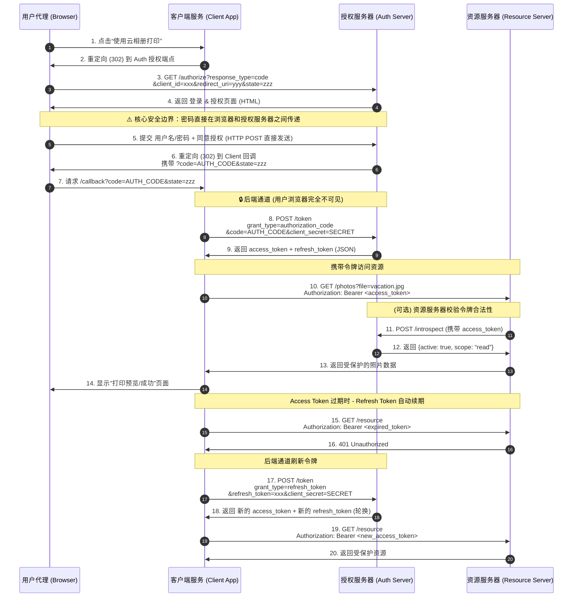

# Authorization Code Flow - Status

## Overview

Authorization Code Flow is the most secure OAuth 2.0 grant type, designed for server-side applications where the client secret can be kept confidential. It uses an authorization code as an intermediate credential, obtained through the resource owner's user-agent, which is then exchanged for an access token through a secure back-channel.

## Components & Ports

| Component | Port | Description |
|-----------|------|-------------|
| Client Application | `:8080` | Third-party app requesting access |
| Authorization Server | `:8081` | Authenticates user and issues tokens |
| Resource Server | `:8082` | Hosts protected resources |

## Endpoints

### Authorization Server (`:8081`)

| Method | Path | Description |
|--------|------|-------------|
| `GET` | `/authorize` | Authorization endpoint — shows login form with client info |
| `POST` | `/authorize` | Processes credentials and consent, redirects with `?code=xxx&state=yyy` |
| `POST` | `/token` | Token endpoint — exchanges authorization code for access token + refresh token; also handles `grant_type=refresh_token` for token refresh |
| `POST` | `/introspect` | Token introspection — validates token for resource server |
| `GET` | `/client` | Shows registered client information |

### Resource Server (`:8082`)

| Method | Path | Description |
|--------|------|-------------|
| `GET` | `/resource` | Protected resource — requires `Authorization: Bearer <token>` |

### Client Application (`:8080`)

| Method | Path | Description |
|--------|------|-------------|
| `GET` | `/` | Home page |
| `GET` | `/login` | Initiates OAuth2 flow — redirects to authorization server |
| `GET` | `/callback` | Handles redirect back — exchanges code for token |
| `GET` | `/resource` | Fetches protected resource using stored access token |
| `GET` | `/debug` | Debug info showing component status and flow description |

## Complete Flow



## Key Security Features

1. **State parameter** — CSRF protection. Client generates a random state value before redirecting, validates it on callback.
2. **Authorization code** — One-time use, 10-minute expiry. Mitigates interception risk.
3. **Client authentication** — Token endpoint requires `client_id` + `client_secret` to prove client identity.
4. **Redirect URI validation** — Authorization server validates redirect_uri matches the registered value.
5. **Access token** — 1-hour expiry, never exposed to the user-agent (obtained via server-to-server call).
6. **Back-channel token exchange** — Code is exchanged for token through direct server-to-server communication.
7. **Refresh token** — Long-lived (30 days), used to obtain new access tokens without re-authentication. Never sent to resource servers.
8. **Refresh token rotation** — Each refresh operation issues a new refresh token and revokes the old one, minimizing the impact of token leakage.
9. **Auto-refresh on 401** — Client detects expired tokens via 401 response and automatically refreshes before retrying.

## How to Run

```bash
# Terminal 1 - Authorization Server
go run ./cmd/Authorization-Code/auth-server/

# Terminal 2 - Resource Server
go run ./cmd/Authorization-Code/resource-server/

# Terminal 3 - Client Application
go run ./cmd/Authorization-Code/client/
```

Then open http://localhost:8080 in a browser.

## Type Definitions

All shared types are defined in `types/response.go`.

### Authorization Request (RFC 4.1.1)
| Field | Type | Required | Description |
|-------|------|----------|-------------|
| `response_type` | `string` | REQUIRED | MUST be `"code"` |
| `client_id` | `string` | REQUIRED | Client identifier |
| `redirect_uri` | `string` | OPTIONAL | Redirection URI |
| `scope` | `string` | OPTIONAL | Requested scope |
| `state` | `string` | RECOMMENDED | CSRF protection |

### Authorization Response (RFC 4.1.2)
| Field | Type | Required | Description |
|-------|------|----------|-------------|
| `code` | `string` | REQUIRED | Authorization code |
| `state` | `string` | REQUIRED* | Echo back request state |

### Error Response (RFC 4.1.2.1 / 5.2)

Error codes are defined as `ErrorCode` type with constants:

| Constant | Value | Where Used |
|----------|-------|------------|
| `ErrorInvalidRequest` | `invalid_request` | Auth / Token |
| `ErrorUnauthorizedClient` | `unauthorized_client` | Auth |
| `ErrorAccessDenied` | `access_denied` | Auth |
| `ErrorUnsupportedResponseType` | `unsupported_response_type` | Auth |
| `ErrorInvalidScope` | `invalid_scope` | Auth |
| `ErrorServerError` | `server_error` | Auth / Token |
| `ErrorTemporarilyUnavailable` | `temporarily_unavailable` | Auth |
| `ErrorInvalidClient` | `invalid_client` | Token |
| `ErrorInvalidGrant` | `invalid_grant` | Token |
| `ErrorUnsupportedGrantType` | `unsupported_grant_type` | Token |

Error response body:
```json
{
  "error": "invalid_grant",
  "error_description": "authorization code has expired"
}
```

### Access Token Request (RFC 4.1.3)
| Field | Type | Required | Description |
|-------|------|----------|-------------|
| `grant_type` | `string` | REQUIRED | MUST be `"authorization_code"` |
| `code` | `string` | REQUIRED | Authorization code |
| `redirect_uri` | `string` | CONDITIONAL | Required if in auth request |
| `client_id` | `string` | OPTIONAL | Not needed if using Basic auth |

### Access Token Response (RFC 4.1.4 / 5.1)
```json
{
  "access_token": "2YotnFZFEjr1zCsicMWpAA",
  "token_type": "Bearer",
  "expires_in": 3600,
  "refresh_token": "tGzv3JOkF0XG5Qx2TlKWIA",
  "scope": "read"
}
```

### Refresh Token Request (RFC 6)

| Field | Type | Required | Description |
|-------|------|----------|-------------|
| `grant_type` | `string` | REQUIRED | MUST be `"refresh_token"` |
| `refresh_token` | `string` | REQUIRED | The refresh token issued to the client |
| `scope` | `string` | OPTIONAL | Requested scope, MUST NOT exceed originally granted scope |

### Introspect Response
```json
{
  "active": true,
  "client_id": "oauth-client-1",
  "username": "demo_user",
  "exp": 1718000000
}
```
