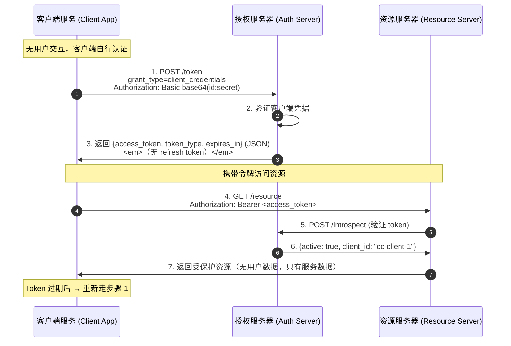

# Client Credentials Grant Flow - Status

## 概述

Client Credentials Grant（客户端凭证模式）是 OAuth 2.0 中最简单的授权模式，专门用于**机器对机器（M2M）通信**。客户端使用自己的凭据（client_id + client_secret）直接获取 access token，**无需用户参与**。

此模式适用于客户端以自己的身份访问受保护资源（客户端本身就是资源拥有者）的场景。

## 与其他授权模式的关键区别

| 特性 | 授权码模式 | Implicit | ROPC | Client Credentials |
|------|-----------|----------|------|--------------------|
| 用户参与 | 需要 | 需要 | 需要 | **不需要** |
| `grant_type` | `authorization_code` | 无 `/token` | `password` | `client_credentials` |
| Refresh Token | 可选 | 不支持 | 可选 | **禁止**（RFC 4.4.3） |
| 用户凭据 | 在授权服务器输入 | 在授权服务器输入 | 经过客户端 | **无** |
| 适用场景 | Web 服务端 | 浏览器 SPA | 高度信任应用 | **M2M / 微服务** |

## 组件与端口

| 组件 | 端口 | 描述 |
|------|------|------|
| Client Application | `:8080` | 客户端（后台服务） |
| Authorization Server | `:8081` | 验证客户端凭据并签发 access token |
| Resource Server | `:8082` | 托管受保护资源 |

## 端点

### Authorization Server (`:8081`)

| 方法 | 路径 | 描述 |
|------|------|------|
| `POST` | `/token` | 令牌端点 — 处理 `grant_type=client_credentials` |
| `POST` | `/introspect` | Token introspection — 验证令牌有效性 |

### Resource Server (`:8082`)

| 方法 | 路径 | 描述 |
|------|------|------|
| `GET` | `/resource` | 受保护资源 — 需要 `Authorization: Bearer <token>` |

### Client Application (`:8080`)

| 方法 | 路径 | 描述 |
|------|------|------|
| `GET` | `/` | 首页 |
| `GET` | `/token` | 使用 client credentials 获取 access token |
| `GET` | `/resource` | 使用 access token 获取受保护资源 |
| `GET` | `/debug` | 调试信息 |

## 完整流程



## 注册的客户端

| Client ID | Client Secret | 描述 |
|-----------|---------------|------|
| `cc-client-1` | `cc-client-secret-1` | 标准客户端 |
| `cc-service-api` | `cc-api-secret-789` | 内部 API 服务 |

## 如何运行

```bash
# Terminal 1 - Authorization Server
go run ./cmd/Client-Credentials/auth-server/

# Terminal 2 - Resource Server
go run ./cmd/Client-Credentials/resource-server/

# Terminal 3 - Client Application
go run ./cmd/Client-Credentials/client/
```

然后打开 http://localhost:8080 访问。

## 类型定义

### Token Request（RFC 4.4.2）

```
POST /token HTTP/1.1
Host: server.example.com
Authorization: Basic base64(client_id:client_secret)
Content-Type: application/x-www-form-urlencoded

grant_type=client_credentials
```

| 参数 | 类型 | 必需 | 描述 |
|------|------|------|------|
| `grant_type` | `string` | REQUIRED | MUST be `"client_credentials"` |
| `scope` | `string` | OPTIONAL | 请求的权限范围 |

### Token Response（RFC 4.4.3）

```json
{
  "access_token": "2YotnFZFEjr1zCsicMWpAA",
  "token_type": "Bearer",
  "expires_in": 3600
}
```

**不包含 refresh_token**（RFC 4.4.3: "A refresh token SHOULD NOT be included"）。

### Error Response

```json
{
  "error": "invalid_client",
  "error_description": "client authentication failed"
}
```

### Introspect Response

```json
{
  "active": true,
  "client_id": "cc-client-1",
  "exp": 1718000000
}
```

**不包含 username**（客户端凭证模式没有用户概念）。
