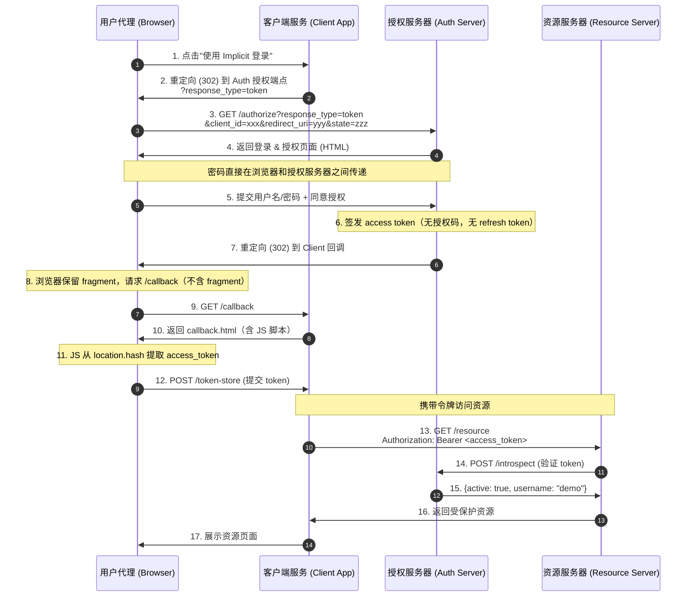

# Implicit Grant Flow - Status

## 概述

Implicit Grant（隐式授权）是 OAuth 2.0 的一种授权模式，**专门为浏览器端公共客户端（Public Client）优化**。与授权码模式最大的区别在于：授权服务器直接返回 access token（放在 URI fragment 中），省去了授权码交换步骤。**不支持签发 refresh token**。

## 与授权码模式的关键区别

| 特性 | 授权码模式 | Implicit Grant |
|------|-----------|----------------|
| `response_type` | `code` | `token` |
| 授权码 | 有（中间凭证） | 无 |
| Refresh Token | 支持 | **不支持**（RFC 禁止） |
| Client Secret | 需要 | 不需要 |
| Access Token 传递 | 后端通道（server-to-server） | 浏览器端（URI fragment） |
| 适用客户端 | 机密客户端 | 浏览器端公共客户端 |
| 令牌提取方式 | 服务器端代码交换 | 浏览器 JavaScript 解析 fragment |

## 组件与端口

| 组件 | 端口 | 描述 |
|------|------|------|
| Client Application | `:8080` | Client 应用（提供 HTML/JS 页面） |
| Authorization Server | `:8081` | 认证用户并直接签发 access token |
| Resource Server | `:8082` | 托管受保护资源 |

## 端点

### Authorization Server (`:8081`)

| 方法 | 路径 | 描述 |
|------|------|------|
| `GET` | `/authorize` | 授权端点 — 展示登录表单，验证 `response_type=token` |
| `POST` | `/authorize` | 处理凭据和授权，重定向（302）并在 fragment 中携带 access_token |
| `POST` | `/introspect` | Token introspection — 验证令牌有效性 |

### Resource Server (`:8082`)

| 方法 | 路径 | 描述 |
|------|------|------|
| `GET` | `/resource` | 受保护资源 — 需要 `Authorization: Bearer <token>` |

### Client Application (`:8080`)

| 方法 | 路径 | 描述 |
|------|------|------|
| `GET` | `/` | 首页 |
| `GET` | `/login` | 发起 OAuth2 流程 — 重定向到授权服务器（`response_type=token`） |
| `GET` | `/callback` | 回调页面 — HTML + JavaScript 从 fragment 提取 access token |
| `POST` | `/token-store` | 浏览器 JS 提交提取到的 token，服务器存储 |
| `GET` | `/resource` | 使用存储的 access token 获取受保护资源 |
| `GET` | `/debug` | 调试信息 |

## 完整流程



## 核心安全要点

1. **State parameter** — CSRF 防护。Client 生成随机 state，重定向时验证。
2. **无 Client Secret** — Implicit 模式不认证客户端身份，仅依赖 redirect_uri 注册验证。
3. **Access Token 在 Fragment** — 令牌放在 URI `#` 后面，避免被中间服务器拦截（Fragment 不会发送到服务器）。
4. **JavaScript 提取** — 浏览器端 JS 从 `location.hash` 提取 token，再通过 AJAX 提交到客户端服务器。
5. **不过期不刷新** — 无 refresh token，access token 过期后需要重新授权。
6. **redirect_uri 验证** — 授权服务器验证 redirect_uri 匹配注册值。

## 如何运行

```bash
# Terminal 1 - Authorization Server
go run ./cmd/Implicit/auth-server/

# Terminal 2 - Resource Server
go run ./cmd/Implicit/resource-server/

# Terminal 3 - Client Application
go run ./cmd/Implicit/client/
```

然后打开 http://localhost:8080 访问。

## 类型定义

### Error Response（RFC 4.2.2.1）

当授权失败时，错误参数以 fragment 形式返回：

```
Location: https://client.example.com/cb#error=access_denied&state=xyz
```

| 参数 | 类型 | 必需 | 描述 |
|------|------|------|------|
| `error` | `ErrorCode` | REQUIRED | OAuth2 标准错误码 |
| `error_description` | `string` | OPTIONAL | 可读的错误描述 |
| `error_uri` | `string` | OPTIONAL | 错误信息页面 URI |
| `state` | `string` | CONDITIONAL | 如果请求中有 state 则必需 |

### Access Token Response（RFC 4.2.2）

成功时 access token 以 fragment 形式返回：

```
Location: http://example.com/cb#access_token=2YotnFZFEjr1zCsicMWpAA&state=xyz&token_type=Bearer&expires_in=3600
```

| 参数 | 类型 | 必需 | 描述 |
|------|------|------|------|
| `access_token` | `string` | REQUIRED | 授权服务器签发的访问令牌 |
| `token_type` | `string` | REQUIRED | 令牌类型（如 Bearer） |
| `expires_in` | `int` | RECOMMENDED | 过期时间（秒） |
| `scope` | `string` | CONDITIONAL | 令牌范围 |
| `state` | `string` | CONDITIONAL | 如果请求中有 state 则必需 |

### Introspect Response

```json
{
  "active": true,
  "client_id": "implicit-client-1",
  "username": "demo_user",
  "exp": 1718000000
}
```
