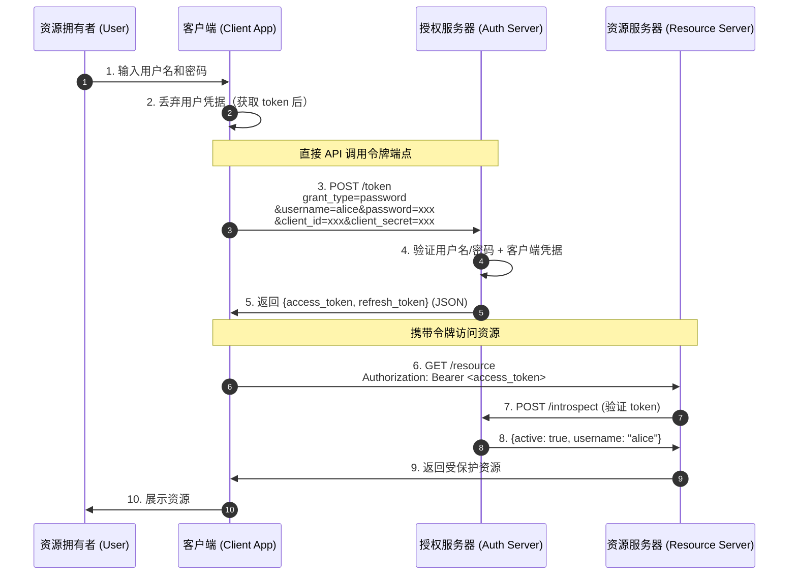

# Resource Owner Password Credentials Flow - Status

## 概述

Resource Owner Password Credentials Grant（密码模式）允许客户端直接使用资源拥有者的用户名和密码来获取 access token。**此模式仅应在资源拥有者与客户端之间存在高度信任关系时使用**（如操作系统级应用或高度特权应用），且其他授权模式不可用时才考虑。

## 与其他授权模式的关键区别

| 特性 | 授权码模式 | Implicit | ROPC |
|------|-----------|----------|------|
| 用户凭据处理 | 用户直接在授权服务器输入 | 用户直接在授权服务器输入 | 凭据**经过客户端**传给授权服务器 |
| 浏览器重定向 | 需要 | 需要 | **不需要** |
| `grant_type` | `authorization_code` | 无 `/token` 端点 | `password` |
| Refresh Token | 可选 | **不支持** | 可选 |
| 适用场景 | Web 服务器端应用 | 浏览器 SPA | 高度信任的第一方应用 |

## 安全注意事项

- **客户端可见用户密码**：用户密码需要经过客户端再发送给授权服务器（RFC 4.3.2）
- **凭据必须丢弃**：获取 access token 后，客户端必须丢弃用户凭据（RFC 4.3.1）
- **暴力破解防护**：授权服务器必须保护令牌端点，防止暴力攻击（RFC 4.3.2）
- **高信任要求**：仅适用于资源拥有者与客户端有高度信任关系的场景

## 组件与端口

| 组件 | 端口 | 描述 |
|------|------|------|
| Client Application | `:8080` | Client 应用（提供凭据输入表单） |
| Authorization Server | `:8081` | 验证凭据并签发 access token |
| Resource Server | `:8082` | 托管受保护资源 |

## 端点

### Authorization Server (`:8081`)

| 方法 | 路径 | 描述 |
|------|------|------|
| `POST` | `/token` | 令牌端点 — 处理 `grant_type=password` 和 `grant_type=refresh_token` |
| `POST` | `/introspect` | Token introspection — 验证令牌有效性 |

### Resource Server (`:8082`)

| 方法 | 路径 | 描述 |
|------|------|------|
| `GET` | `/resource` | 受保护资源 — 需要 `Authorization: Bearer <token>` |

### Client Application (`:8080`)

| 方法 | 路径 | 描述 |
|------|------|------|
| `GET` | `/` | 首页 |
| `GET` | `/login` | 凭据输入表单 |
| `POST` | `/login` | 提交凭据到授权服务器获取 token |
| `GET` | `/resource` | 使用 access token 获取受保护资源（支持自动刷新） |
| `GET` | `/debug` | 调试信息 |

## 完整流程



## 内置用户

| 用户名 | 密码 |
|--------|------|
| `alice` | `password123` |
| `bob` | `secret456` |

## 如何运行

```bash
# Terminal 1 - Authorization Server
go run ./cmd/Resource-Owner-Password-Credentials/auth-server/

# Terminal 2 - Resource Server
go run ./cmd/Resource-Owner-Password-Credentials/resource-server/

# Terminal 3 - Client Application
go run ./cmd/Resource-Owner-Password-Credentials/client/
```

然后打开 http://localhost:8080 访问。

## 类型定义

### Token Request（RFC 4.3.2）

```
POST /token
Content-Type: application/x-www-form-urlencoded
Authorization: Basic base64(client_id:client_secret)

grant_type=password&username=johndoe&password=A3ddj3w
```

| 参数 | 类型 | 必需 | 描述 |
|------|------|------|------|
| `grant_type` | `string` | REQUIRED | MUST be `"password"` |
| `username` | `string` | REQUIRED | 资源拥有者的用户名 |
| `password` | `string` | REQUIRED | 资源拥有者的密码 |
| `scope` | `string` | OPTIONAL | 请求的权限范围 |

### Token Response（RFC 4.3.3）

```json
{
  "access_token": "2YotnFZFEjr1zCsicMWpAA",
  "token_type": "Bearer",
  "expires_in": 3600,
  "refresh_token": "tGzv3JOkF0XG5Qx2TlKWIA"
}
```

### Error Response

```json
{
  "error": "invalid_grant",
  "error_description": "invalid username or password"
}
```

### Introspect Response

```json
{
  "active": true,
  "client_id": "ropc-client-1",
  "username": "alice",
  "exp": 1718000000
}
```
