# OAuth2.0

本文主要讲讲的还是 OAuth2.0 的机制，请不要和 OAuth1.0 相混淆哦。

## OAuth1.0 与 OAuth2.0

- OAuth2.0 全称Open Authorization (OAuth) 2.0 Authorization Framework，对应 RFC 6749 的标题：The OAuth 2.0 Authorization Framework，开放授权2.0。
- OAuth1.0 的全称Open Authorization 1.0，RFC 5849 的标题：The OAuth 1.0 Protocol

> Auth = Authorization（授权，不是 Authentication 认证）

### 授权(Authorization) 和 认证(Authentication) 的差别

- 
- 认证：用户名+密码


## 四大角色

- 资源拥有者（用户）：
- 资源服务器：
- 授权服务器：
- 用户的客户端（第三方平台）：

> OAuth2.0 让浏览器做为重定向，从“用户的客户端”到“授权服务器”，但是有条件：“用户的客户端”需要先与“授权服务器”建立信任，分配 Client-Id 和 Client-Secret，并告知“授权服务器”，在授权完成后重定向的 URL 


## 授权模式

### Authorization Code

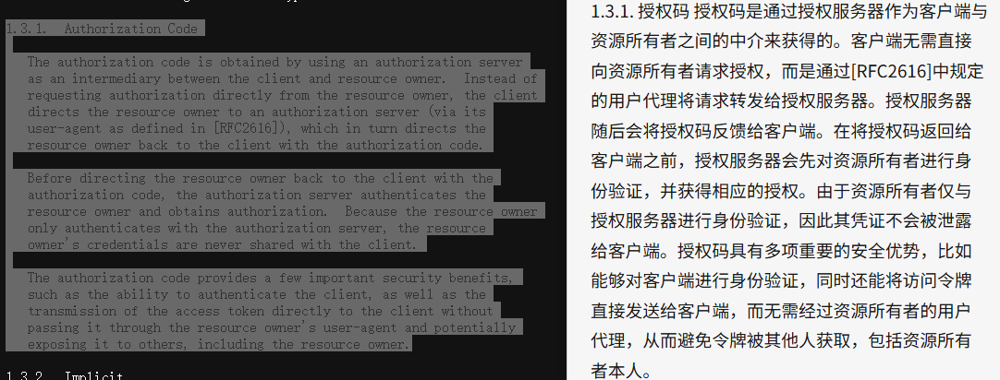

核心的内容：

- "授权码是通过使用授权服务器作为客户端和资源所有者之间的中介来获得的。"
- "由于资源所有者仅向授权服务器进行认证，因此资源所有者的凭证永远不会与客户端共享。"
- "授权服务器再将资源所有者重定向回客户端并携带授权码。"
- "将访问令牌直接传输给客户端，而无需经过资源所有者的用户代理。"
- "授权码提供了一些重要的安全优势，例如能够对客户端进行身份验证。"

#### 案例

1. 你 (资源所有者)：在“云相册”存有照片。
2. 打印服务 (客户端)：想帮你打印照片。
3. 云相册 (服务端)：拥有你的照片资源。
4. 目标：让打印服务安全地访问照片，而不需要你把账号密码给它。

采用 OAuth2.0 的 `Authorization Code` 完成授权

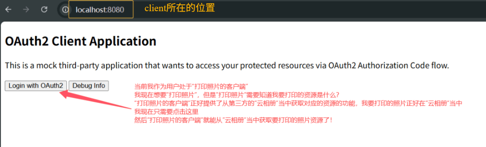
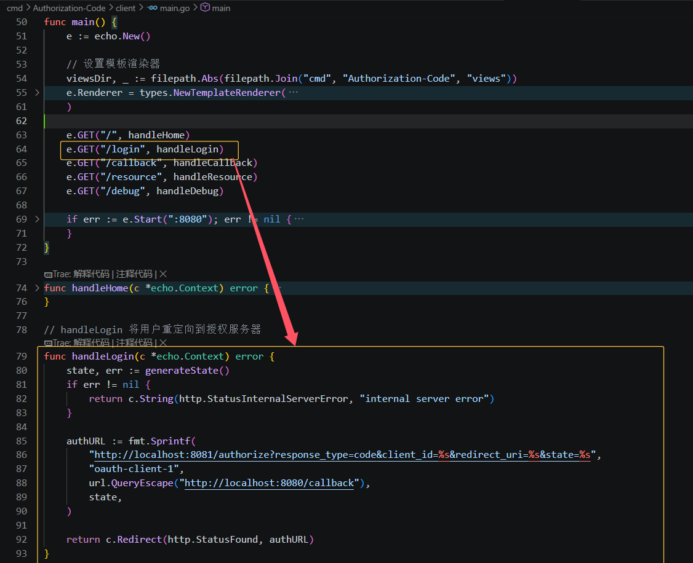
A. “客户端”发送请求“授权服务器”的同时提供自身的客户端标识符（client_id）、所请求的权限范围（scope~~这里实现省略了~~）、本地状态（state），以及一个重定向URI（redirect_uri）。

> 其中的 `state` 是为了防止 CSRF 攻击的，它是“客户端”生成一个随机字符串放在里，用来标识校验用户在“客户端”生成`state`发送给“授权服务器”后（本质是一个一次性的、随机的、与当前用户浏览器会话（Session）绑定的临时密码。），需要在“授权服务器”发送回“客户端”是一样的，如果不一致，直接拒绝，从而阻断访问 `<客户端>/callback?code=Code_hacker` 的攻击。
> "客户端" / "授权服务器" 无防止 CSRF 的 state，那么黑客已经通过“客户端”向“授权服务器”发送了 `https://<授权服务器>/authorize?response_type=code&client_id=Client-id-1&redirect_uri=http://<客户端>/callback&scope=email` 从而得到一个已经完成认证从"授权服务器" 返回到 "客户端" 的 `https://<客户端>/callback?code=Code_hacker` 的 URL，那么因为"客户端"没有设置 state，从而让“客户端”在可能通过访问“资源服务器”获取用户信息时，得到的用户信息是 Hacker 的，也就是可能“客户端”要发生邮件给当前“客户端”使用的用户，然后从“资源服务器”得到 email，向这个 email 发生邮件，但是这个 email 其实是 hacker 的邮件，那 hacker 就能看到原本“客户端”发送给用户的 email 信息了。 

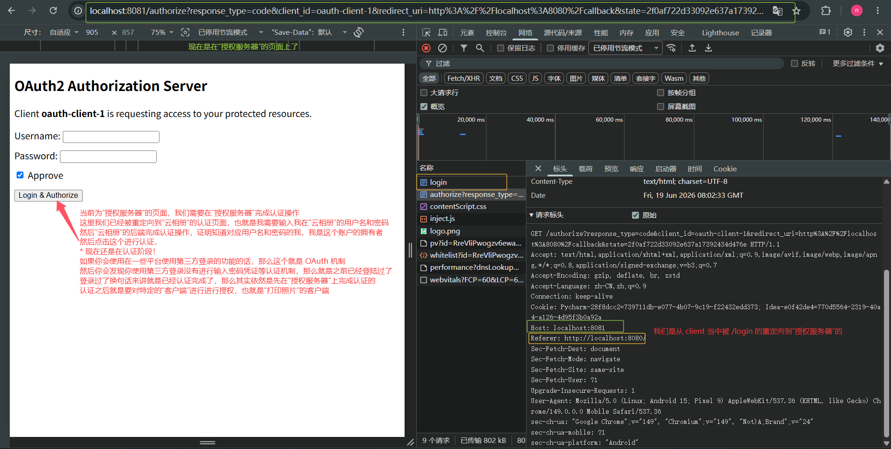
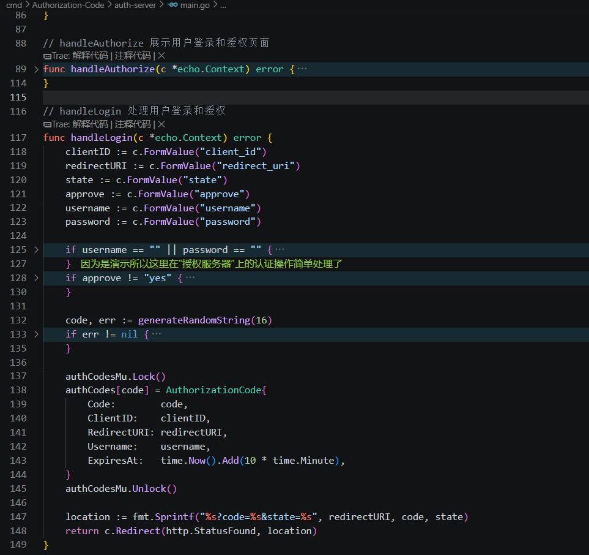

B. 用户认证，如图中描述的一样，如果用户刚才已经在浏览器里登录了“授权服务器”的资产（Session 未过期），那么这一步可以不需要用户再次输入密码。浏览器会自动携带 “授权服务器”资产的登录 Cookie 给授权服务器，实现“一键授权，无需重复登录”，这个属于体验的优化。

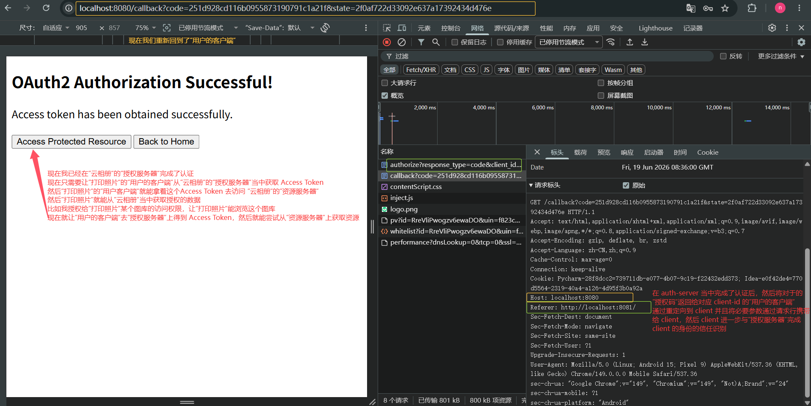

C. 前端传输的是授权码，“客户端”的后端才是那种授权码去换领取 Token 的，在前端（浏览器）当中浏览器的地址栏、历史记录、HTTP Referer 头都可能泄露这个 Code，浏览器按下 F12 就能看到 Request 和 response，即使 Code 被泄露了，一般 Code 的有效期不会太久，但是 Access Token 泄露了，因为 Access Token 可用时间可能会很久的，从而造成危害和风险可能更大，所以不在前端传输 Access Code，并且如果单拿到 Code 也没有用，还需要 Client-secret 才能去找 “授权服务器” 颁发 Access Token。
D. "客户端" 后端再次验证....
E. "授权服务器" 颁布 Access Token ......
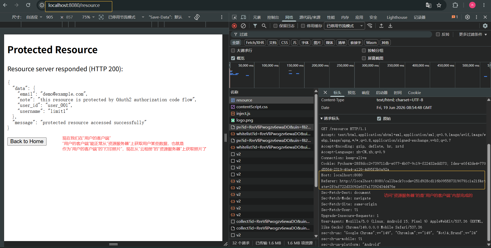
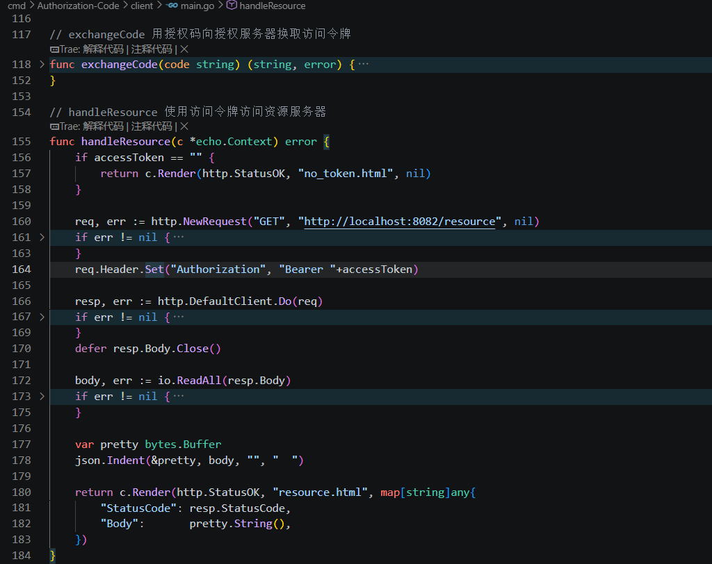
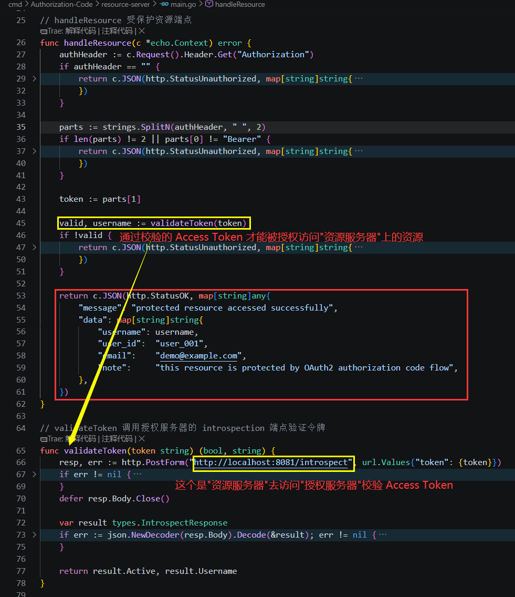

F. "客户端"后端在拿到 access_token 后会参照 rfc6750 的标准，将 Access Token 放在 HTTP Authorization 请求头进行传递 `Authorization: Bearer <Access Token>`
G. "资源服务器"验证 Access Token 主要有两种方式，一种是基于 JWT 进行签发，也就是先生成一对非对称加密的密钥对，“授权服务器”存放私钥，“资源服务器”存放公钥，收到 Access Token 后 “资源服务器” 去对 JWT 的Signature 进行解密，验证这个 Access Token 是来自于 “授权服务器”颁发的；还有一个的就是“资源服务器”再去询问“授权服务器”，询问 自己收到的这个 Access Token 是不是 “授权服务器” 颁发的，这个方法也是这个案例的实现。
H. "资源服务器" 验证成功 Access Token，根据“授权服务器”在 Access Token 当中的 payload 当中找到描述的访问的 scope，然后返回对应的信息给“客户端”。 

上面的能看到的流程本质是就是  当中的内容：
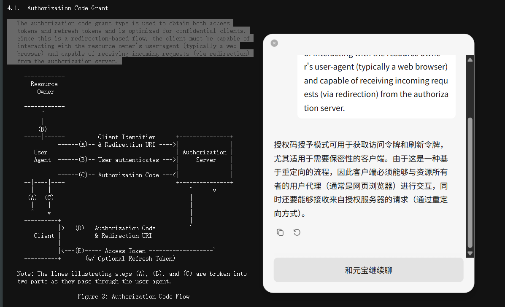


那么看不到的流程是？其中是 D、E、F、G，这里 F、G 在前面已经描述了，而 D、E 是设置的悬念，现在来补充完善，主要看 “客户端” 和 “授权服务器” 的代码。
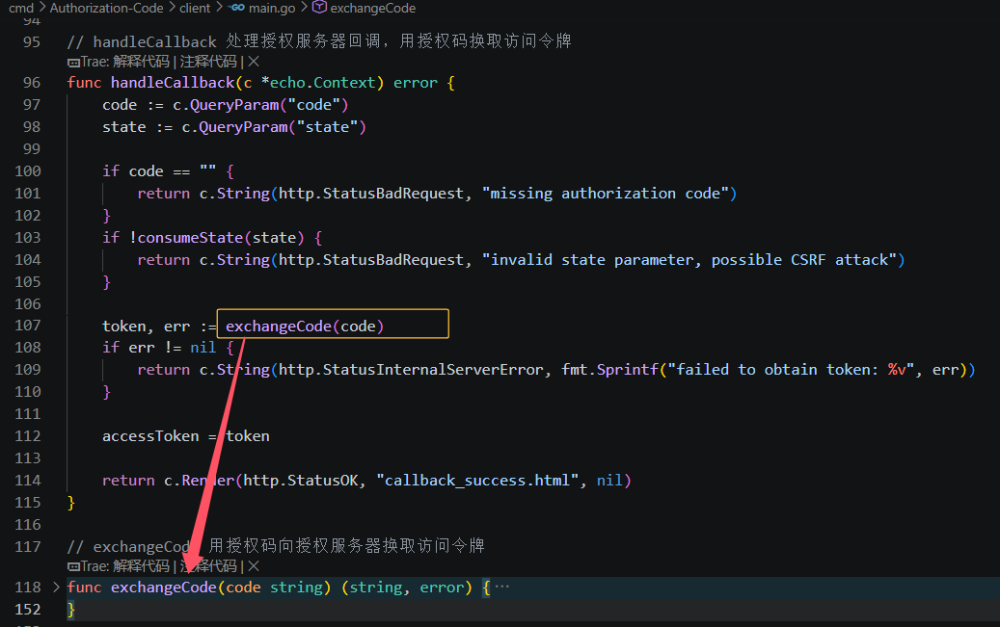
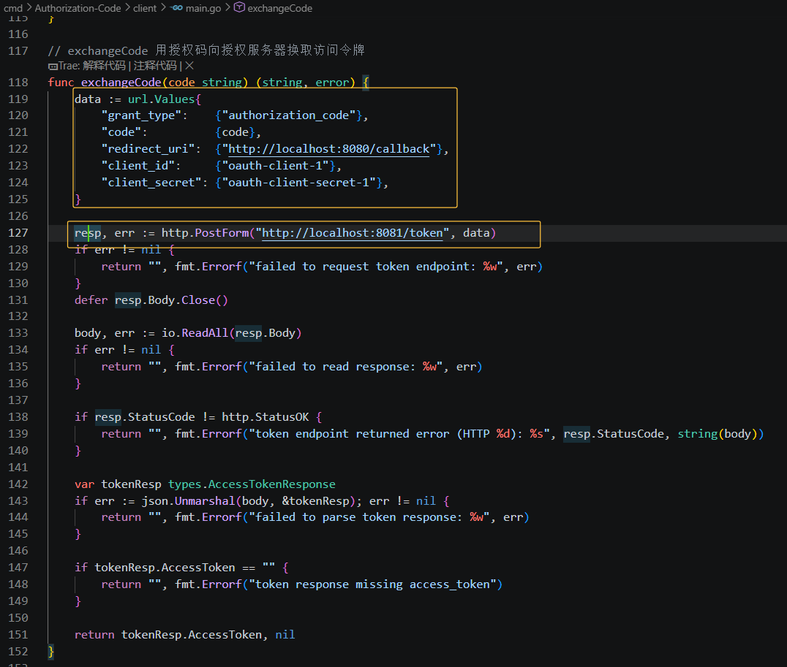
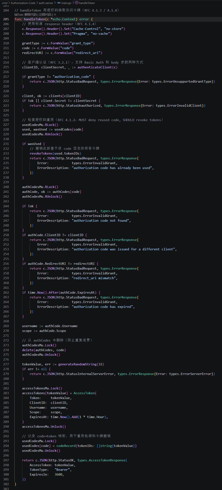
这里的 handleToken 的实现有些复杂，因为颁布 Access Token 这个是很重要、很严肃的业务场景。
C. 前端传输的是授权码，因为我们这个场景为了防止 CSRF ，还设置了 `https://<客户端>/callback?code=Code_xxx&state=zzzz` 的 state 参数，所以在 handleCallback 当中的获取从 echo.Context 的上下文当中获取 code 和 state，这里 state 的参数作用参照上面的 C ，其中 consumeState 就是按照上面 C 的设想进行实现。
D. "客户端" 后端再次验证，这里的验证就是去携带参数再去访问“授权服务器” 请求的 URL 和参数 为：`http://<授权服务器>/token?grant_type=authorization_code&code=刚才拿到的AUTH_CODE&redirect_uri=http://<客户端>/callback&client_id=oauth-client-1&client_secret=oauth-client-secret-1`，然后就让“授权服务器”进行处理，让“授权服务器”颁布 Access Token
E. "授权服务器" 颁布 Access Token，这里是最复杂的也是要最小心的，前面的 Response 设置了 Cache-Control: no-store 和 Pragma: no-cache 是为了防止含有 Token 的响应被浏览器或代理服务器缓存到磁盘，使用了 usedCodes 来记录已消费的 Code，并配合 delete(authCodes, code) 物理删除（“授权码不得使用超过一次”），authCode.ClientID != clientID 防止了恶意第三方客户端拿着盗取来的 Code 去换自己的 Token，authCode.RedirectURI != redirectURI 这里就是 “为什么要再传一次 redirect_uri” 防止“授权码拦截攻击”的实现，前面的都是为了安全性而进行的认证，最后得到的就是一个 Access Token，这里简单使用 generateRandomString(32) 处理了，正常业务的可以使用 JWT，这样“资源服务器”只需用公钥进行本地解码验签即可；也因为我们采用的是32为无意义的字符串，所以在 G 当中的“资源服务器”进行验证 Access Token 是否合法是通过再去询问“授权服务器”完成的。

> 为什么要再传一次 redirect_uri？这是为了防止授权码拦截攻击。如果步骤 A 中，黑客把回调地址改成了他自己的 <hacker客户端>/callback，在用户授权后，Code 就会发到黑客那里，也就是黑客获取到了一个 Code 。但在步骤 D 中，“客户端”（正牌应用）向授权服务器发送 Token 请求时，附带的 redirect_uri 是合法注册的 <客户端>/callback。授权服务器一比对，发现“步骤 A 里的回调地址”和“步骤 D 里传来的回调地址”不一致，立即拒绝发放 Token，也就是它要保证 A B C D E 就只能有两个人“客户端”和“授权服务器”在进行同步认证和授权

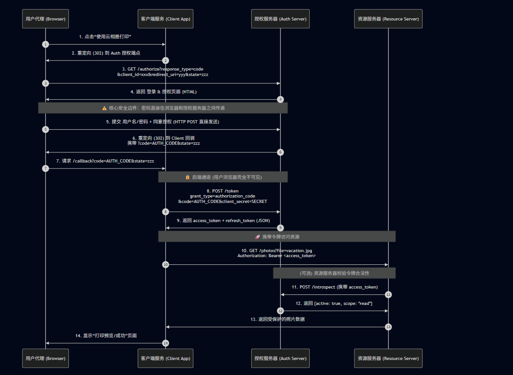

> 这里如果继续扩展可以再扩展 Access Token 和 Refresh Token 

#### Token 

##### Access Token

> 这里简单描述一下 Access Token 的作用

首先 Access Token 本质：

1. 一串字符，计算机不认识它，只有授权服务器和资源服务器认识它
2. 客户端不需要也不应该去解读这串字符的含义，因为它不需要知道这串字符里包含什么用户 ID、什么过期时间，它只需要机械地把它存起来，并在请求时带上它；
3. 这串字符串本身没有意义，但在授权服务器的数据库（或 Redis）里，它对应着一条记录：“此 Access Token 代表用户<谁>，拥有 <访问什么的> 的权限，有效期 <持续多久> 小时”，这个属于不透明令牌；或者采用自包含令牌（典型的实现 JWT），可以不在 Redis 当中存储，可以减少每次请求都要查一次数据库的网络延迟，但是也能记录到 Redis 当中进行随时“强制踢人”，而不是“定期踢人”操作，因为 Access Token 在有效期当中都是有效的。

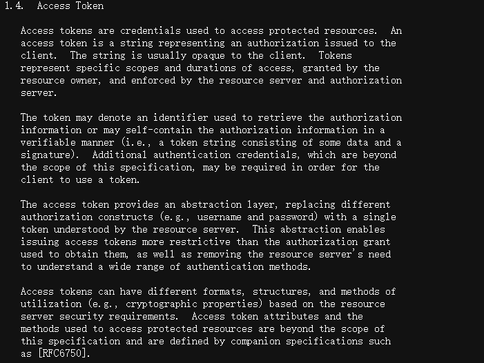

抓住一个关键信息，这个 Access Token 是一个字符串，这个字符串能作为一个凭证访问某些资源，为了安全性最好有失效的时间。

> "客户端不需要也不应该去解读这串字符的含义"，如果是 JWT 格式的话 Header.Payload.Signature 构成，可以尝试使用 Base64 进行解密，但是不是传统标准的 Base64，是 Base64URL，Base64URL 将 Base64 生成 ‘+’ 替换成 ‘-’，‘/’ 替换成 ‘_’，原本的末尾填充‘=’，变为直接删除所有‘=’，因为JWT每段长度是固定的，不需要‘=’补位。 
> 在没有 OAuth 之前，客户端访问资源服务器，要么用“账号密码”（不安全），要么用“API Key”（容易被盗），要么用“IP 白名单”（不灵活）。采用 Access Token 的话，不管你内部怎么认证用户，对外统一只发一个 Access Token 进行授权。资源服务器只需要完成“怎么验证 Token”这一鉴权操作，极大降低了系统间的耦合度

##### Refresh Token

**Access Token 是一个字符串，这个字符串能作为一个凭证访问某些资源，为了安全性最好有失效的时间。**
那么失效时间设置多久合适？“方便往往是安全的敌人”、“技术的选择是服务于需求的，技术的迭代升级也是从实际需求当中来的，偏离实际需求的技术堆叠那么就是矫揉造作”。
扯多了，直接结合实际场景模拟思考一下就行了，

1. 把 Access Token 有效期设得很短（比如 5 分钟）
    - 安全性：极高。即使 Access Token 被泄露了，5 分钟后就失效了，不会泄露更多的数据。
    - 用户体验：用户每 5 分钟就要重新走一遍 认证（输入密码）+授权（点击授予权限） 的流程，也就是上面者案例演示，如果你觉得那几步能接受的话，那么说明符合你所处于的业务场景，总有人会觉得和每次这样干和开屏小广告一样烦躁，然后客户打电话来了QwQ。
2. 把 Access Token 有效期设得很长（比如 7 天）
    - 用户体验：很好，用户一次登录爽一周，或者一直更长时间，永远不会失效！那么很开发者和用户都很喜欢，因为很简单和便利。
    - 安全性：Hacker 我也很喜欢！拿到这个 Token，我可以在整整 7 天内为所欲为，甚至更久如果是无状态的（比如 JWT），服务器无法主动让它失效，只能干瞪眼等它过期。

所以说“那么失效时间设置多久合适？”，或者如何既能保证安全性，又能提升安全性？“原有的方法行不通就推翻，或者在原有的方案上进行缝缝补补加一层”，加了一层 Refresh Token。

一样的作为 Token，它依然和 Access Token 类似，是“一串字符，能作为授权许可”，如果 Access Token 和 Refresh Token 完全一样的话，那么看起来好像没太大的作用。

1. Access Token 是发给资源服务器看的。
2. Refresh Token 是只发给授权服务器看的。

> “Unlike access tokens, refresh tokens are intended for use only with authorization servers and are never sent to resource servers.”（刷新令牌只用于授权服务器，永远不要发给资源服务器。）

然后呢？Refresh Token 是只发给授权服务器看？看了之后呢？
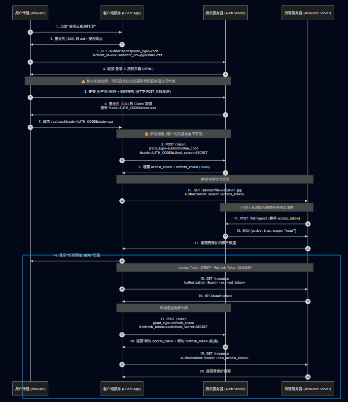
首先保证安全性，也就是把 Access Token 有效期变较短，然后我们再考虑用户体验，采用 Refresh Token 与 Access Token 结合的机制，在 Access Token 失效时，“资源服务器”在收到 Access Token，然后认证失败，“资源服务器”按照 rfc1945 的规范，向“客户端”返回 401（Unauthorized） 的状态码，因为“资源服务器”向“授权服务器 或者 “资源服务器”本地验签时，已经无法认识这个凭证，认为这个凭证就是 Unauthorized（无授权）的~~（其实应该叫做未认证的，因为你这个 Token 是通过认证之后产生的 Code 在进行授权的产生的 Token，并且触发 401 之后，如果没有 Refresh Token 机制的话，也是让用户重新走一遍认证+授权的流程）~~，也就是服务器在服务器检验 request 的 WWW-Authenticate 头时，可能是 Token 缺失、Token 过期、Token 签名无效。

在“客户端”向“资源服务器”携带 Access Token 请求资源时，“资源服务器” 返回了 401，然后就通过 Refresh Token 进行换发（刷新） Access Token 的有效期，Refresh Token 被设计的有效时间是比 Access Token 的时间长的，让“客户端”的应用在后台替“用户”续签 Access Token，从而不必破坏用户的体验，简单来讲就是封装了一层，将原本需要用户参与的认证+授权的流程，通过 “客户端” 使用在 “授权服务器” 获得的 Refresh Token 一步完成了。

> 为什么 Refresh Token 能代替用户完成认证+授权？Refresh Token 是在用户第一次登录（认证）时，在授权服务器面前输入了密码，也就是 Refresh Token 已经代表“用户”完成了认证了。
> Refresh Token 被设计的有效时间是比 Access Token 的时间长，那么 Refresh Token 的安全性如何考虑？首先 Refresh Token 出现的时机是在“授权服务器”为“客户端”颁发 Token 时 和 “客户端” 向 “授权服务器” 续期 Access Token 时，也就是它能出现在网络上的机会也就两次，剩下的时间就是保留在“客户端” 和 “授权服务器” 的服务器上；并且 Refresh Token 看似有效期是比 Access Token 的更长，但是在每次“客户端”用 Refresh Token 换取新的 Access Token 时，“授权服务器”不仅发新的 Access Token，还同时发一个新的 Refresh Token，并且立即作废客户端刚才使用的那一个旧 Refresh Token，~~类似于 Access Token 在 game over （换发 Access Token 时）必须拉着 Refresh Token 一起完蛋（连同 Refresh Token 一起换发）~~。
> 那么 Hacker 得到  Refresh Token 不是能一直得到  Refresh Token 和 Access Token ？这里提供一个 Refresh Token Rotation + Reuse Detection 方法，正常 Refresh Token Rotation 轮换时将旧 token 记录下，如果提交的 Refresh Token 是已轮换的 token 那么就判定为重放攻击，将当前所有活跃 token 都彻底撤销也包括关联的 access tokens，也就是 Hacker 和 “客户端” 只要两者都进行过一次 Refresh Token Rotation (换发  Refresh Token 和 Access Token )，那么两者都无法再次使用 Token 访问“授权服务器”和“资源服务器”，而这时就需要“用户”再次走一遍 Authorization Code 的流程；或者进行  Sender-Constrained ，让 Refresh Token 和 “客户端” 进行进一步绑定，比如 Refresh Token 和"客户端"的设备指纹绑定、绑定私钥、绑定证书。具体的可以去看 

##### 总结

Access Token 是作为凭证让”客户端“拿它去”资源服务器“取资源，Refresh Token 是作为凭证让”客户端“拿它去”授权服务器“去换发 Access Token 和 Refresh Token。

> 另外 Refresh Token 换发的  Access Token 时，如果客户端在 Refreshing an Access Token 请求中包含了 scope 参数，那么​​所请求的范围绝对不能包含任何当初 Access Token 未授权的权限​​。也就是说，新请求的范围必须是原始授权范围的子集或等于原始范围。

### Implicit

先说现在 Implicit 的使用情况。
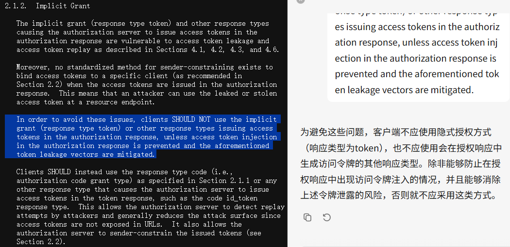

- "隐式授权（response_type=token）以及其他会导致授权服务器在授权响应中直接颁发访问令牌的响应类型，都容易受到访问令牌泄露和重放攻击的影响"
- "当访问令牌在授权响应中颁发时，目前尚无标准化的方法可以将访问令牌发送方约束（Sender-Constrained）到特定的客户端"
- "客户端不应该（SHOULD NOT） 使用隐式授权（response_type=token）或其他在授权响应中颁发访问令牌的响应类型"
- "客户端应该（SHOULD） 改用 response_type=code（即授权码授权类型），或任何其他能让授权服务器在令牌响应（Token Response）中颁发访问令牌的响应类型（例如 code id_token）"

> 为了简化没有后端的纯前端开发，牺牲安全换便利；多年来，大量的 Token 泄露、XSS 攻击、中间人截获证明，为了方便将访问令牌不再暴露在 URL 中，整体攻击面会很大。

#### 案例对比

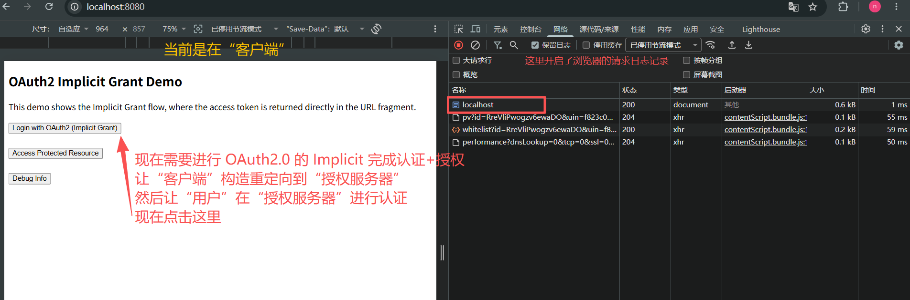
A. 客户端发起请求，包含 client_id、scope、state 和 redirect_uri 浏览器发起授权请求
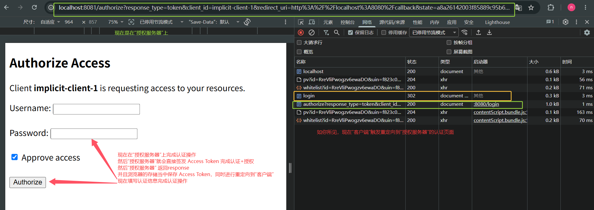
B. 授权服务器认证用户，并获取用户同意，用户输入密码，点“同意授权”

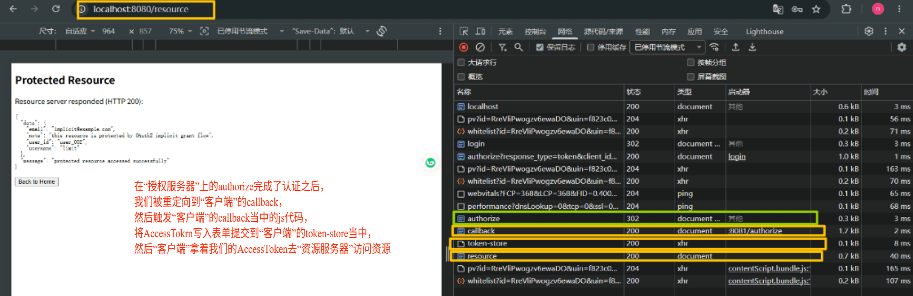
[用户无感知]
C. “授权服务器”重定向，在 URL Fragment 中直接包含 Access Token（Location: ...#access_token=xxx）
D. 浏览器遵循重定向，但 Fragment 不会发给 “客户端”，在请求 callback 页面时不带 # 部分
E. “客户端” 返回一个包含脚本的 HTML 页面，这里是返回 callback.html，里面有 JS 脚本。
F. 浏览器执行脚本，从 Fragment 里提取 Access Token，JS 读取 window.location.hash
[所见]
G. 浏览器把 Token 交给“客户端” JS 使用，“客户端” 拿到 Access Token，“客户端” 带着 Access Token 向 “资源服务器” 拿资源。 

这里在浏览器的历史记录当中，Access Token 已经暴露在浏览器的日志当中（`Location: http://<客户端>/callback#access_token=<前端光明正大写Access-Token>&token_type=Bearer&expires_in=3600&state=<客户端随机xxxx>`），
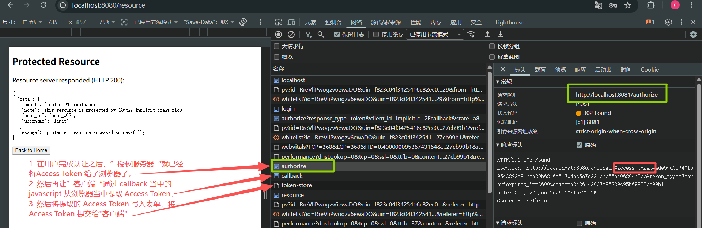
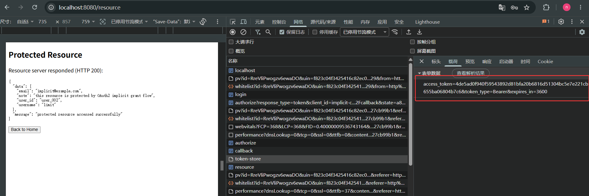
在 callback.html 中的 JS 从 location.hash 提取 token `var hash = window.location.hash.substring(1)`，一样的如果 callback 页面有任何 XSS 漏洞，攻击者的脚本可以直接读取 location.hash 并窃取 Access token。
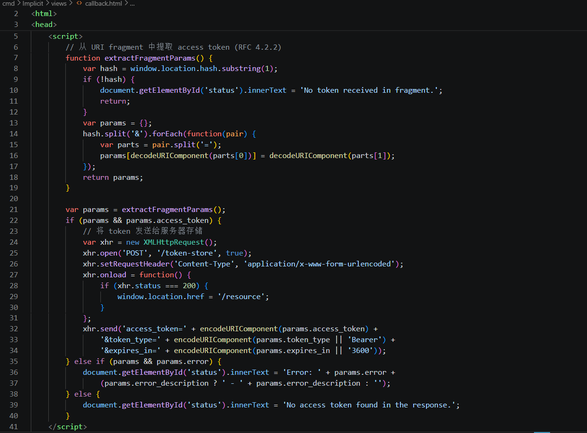

而在 Authorization Code 模式当中，在浏览器当中传递的是 Authorization Code，而 Access Token 是的授予是“客户端”的内部的后端和“授权服务器”完成的，不像 Implicit 是通过前端在浏览器上完成 Access Token 的转交。
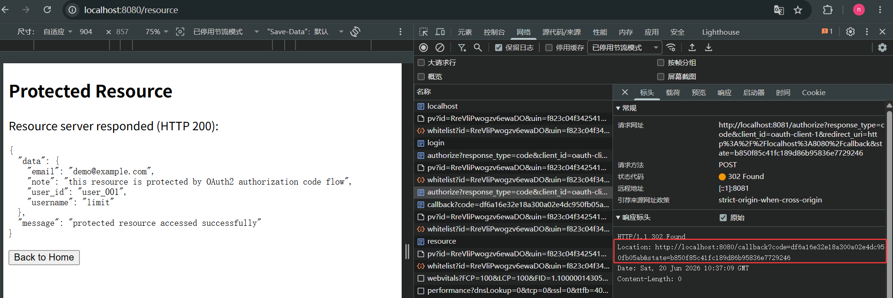

整个流程的时序:
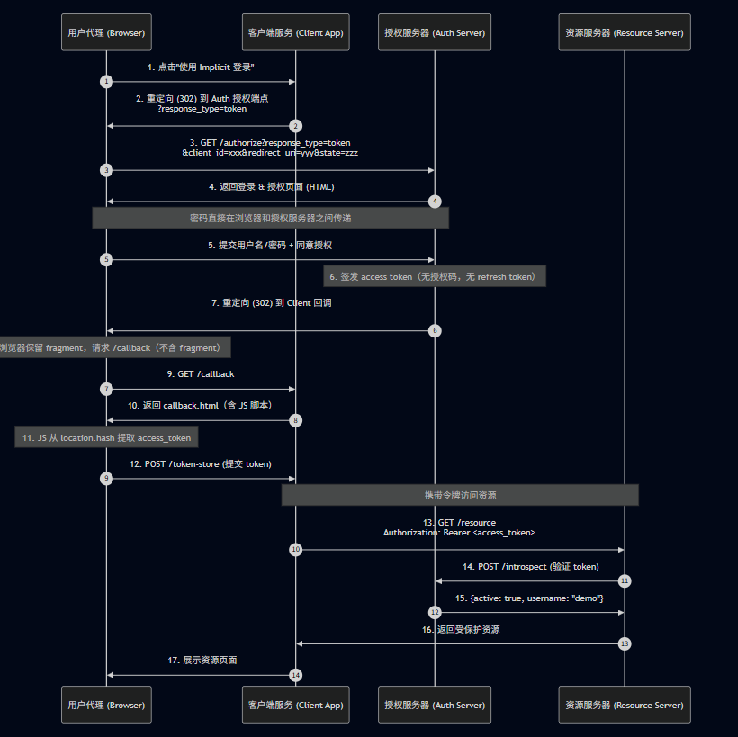
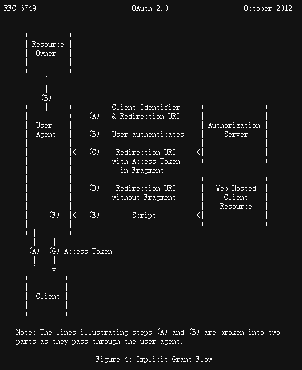

> no standardized method for sender-constraining exists to bind access tokens to a specific client(目前尚无标准化的方法可将访问令牌绑定到特定客户端，以限制发送方)

现在就能理解 Implicit 章节开头所示的这个问题（“无标准化的方法可将访问令牌绑定到特定客户端”）了，在 C 当中 Access Token 是通过 HTTP 重定向（Location: ...#access_token=xxx）直接从"授权服务器" 发给浏览器的，这整个过程中没有经过“客户端”的后端服务器的中转，也就是说任何在接收 Token 时无需出示私钥或客户端证书，然后“授权服务器只能发一个“谁拿到都能用”的 Access Token，对比一下 Authirization Code，Access Token Token 是通过“客户端”的后端像“授权服务器”的 Token Endpoint 颁发，就是“客户端”后端服务器发起的 POST /token 请求到“授权服务器”，这时客户端后端可以在这一步，主动出示自己的私钥（DPoP Proof）或 TLS 证书（mTLS）（但是在我这个 Authirization Code 的 D 环节当中是采用 `client_secret=oauth-client-secret-1` 作为对称密钥（客户端和授权服务器各持一份），确保了只有拥有这个 Secret 的合法“客户端”后端服务器才能完成授权的得到 Access Token），Implicit 模式并没有很严谨的判定得到 Access Token 的人一是 “客户端”，因为通过 浏览器 做了中转，所有暴露了更大的攻击面。

### Resource Owner Password Credentials

在 Implicit 的介绍当中，RFC 9700 推荐客户端应该（SHOULD） 改用 response_type=code（即授权码授权类型），那么它并没有提及 Resource Owner Password Credentials （grant_type=password）这种方式，那么 密码模式 在  RFC 9700 当中的评价也肯定和 Implicit 大差不差：
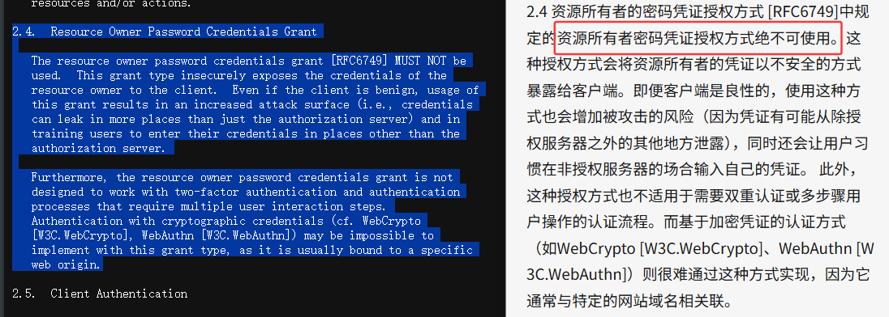
Resource-Owner-Password-Credentials 是 **MUST NOT（绝对禁止）！**，而 Implicit 还只是 SHOULD NOT（强烈不建议）。

- "该授权方式会以不安全的方式向客户端暴露资源所有者的凭据。"
- "凭证不仅可能从授权服务器泄露，还可能从其他地方泄露。"
- "正在培训用户在授权服务器之外的其他地方输入凭据。"
- "资源所有者的密码凭证机制并不适用于需要双重认证，或是那些要求用户进行多步操作才能完成认证的流程。"

#### 简单案例

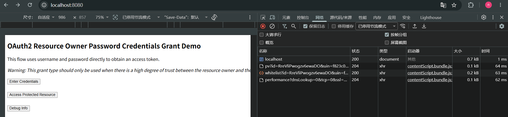
A. "用户"(资源所有者)向"客户端"提供其用户名和密码。
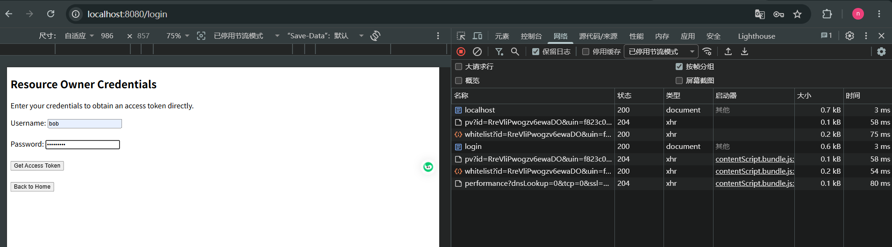
B. "客户端"通过包含从"资源所有者处"获得的凭据，向"授权服务器"的令牌端点请求访问令牌。在发起请求时，"客户端"会与"授权服务器"进行身份验证。
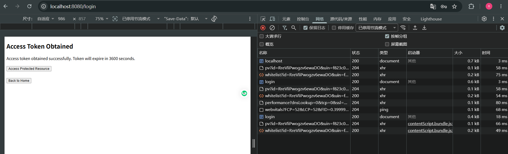
C. "授权服务器"对"客户端"进行身份验证，并验证"资源所有者"的凭证，如果有效，则颁发访问令牌。
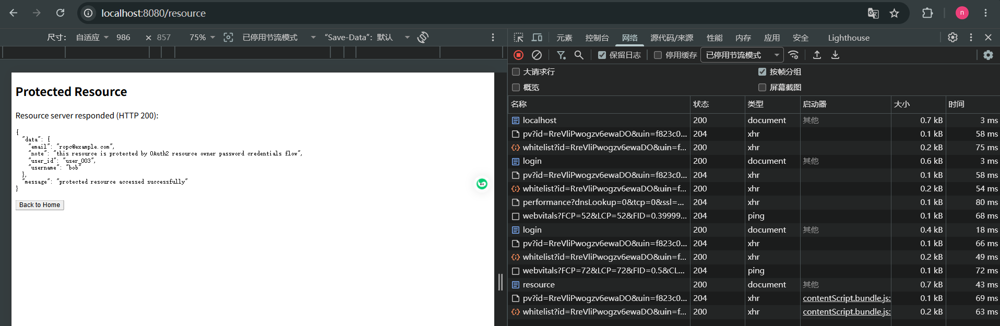

与前面几个的核心差别是**用户的认证的操作是在"客户端"代为完成的**，而前面的 Authorization Code 和 Implicit 都是在 “授权服务器”直接完成的~~（为了方便，这些案例的“客户端”、“授权服务器”、“资源服务器”都是在 localhost 主机下，而 clent 为:80、auth-server为:81、resource-server为:82，也就是同一主机下的不同端口）~~

表面用户发起的就是这四个请求，都是用户请求“客户端”；现在思考一个问题

```cmd
curl -c cookies.txt -b cookies.txt http://localhost:8080/

curl -c cookies.txt -b cookies.txt http://localhost:8080/login -H "Referer: http://localhost:8080/"

curl -c cookies.txt -b cookies.txt http://localhost:8080/login -H "Referer: http://localhost:8080/login" --data-raw "username=bob&password=secret456"

curl -b cookies.txt http://localhost:8080/resource -H "Referer: http://localhost:8080/login"
```

整体加上“客户端”内部与“授权服务器”和“资源服务器”的实际调用表现：
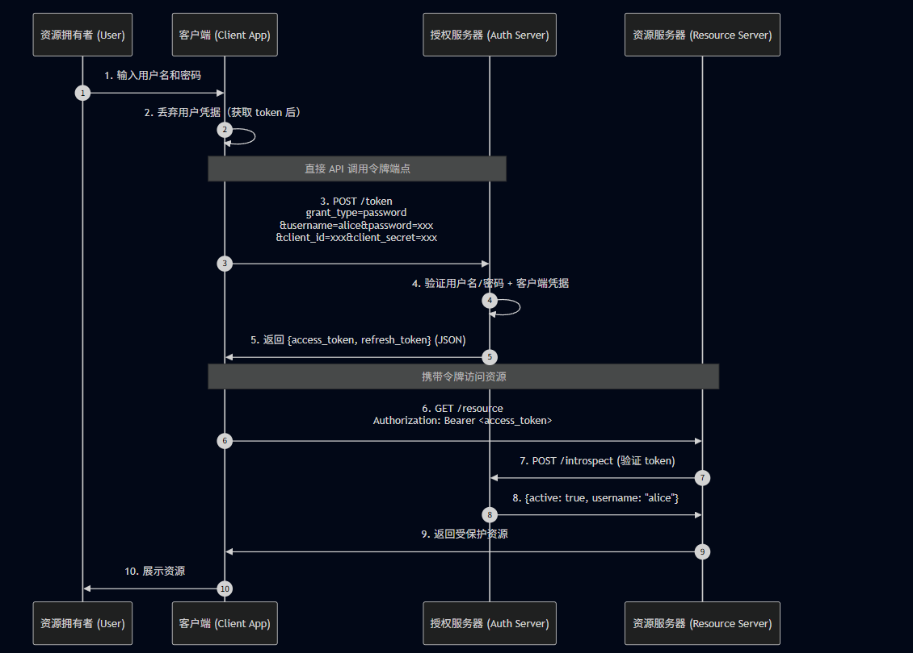
在“客户端”的内部，原本用户凭证（账号+密码）产生认证的根本位置是在“授权服务器”当中，现在将用户凭证直接暴露给"客户端"，让“客户端”通过 RFC 的约定进行实现，从 RFC6749 的 4.3.1 的约束设想，那么确实实现了 “让第三方应用代你访问你的数据，但你不用把密码给它”（吗？），反正我觉得 `Resource Owner Password Credentials` 这个授权模式的提出有些“滥竽充数”的样子，你本身就是不想让“客户端”去知道用户的认证凭证，那么你为什么还要告诉“客户端”？这不就是掩耳盗铃吗？靠"客户端"的自觉来保证安全？反正 `Resource Owner Password Credentials` 就是很奇怪的一个授权模式，如果按照 RFC6749 的 4.3.1 的约束设想（在“客户端”获取完 Token 后删除本地用户凭证，之后使用 Token 向 Resource Server 获取数据）那么确实也完成了 OAuth 的部分设想。
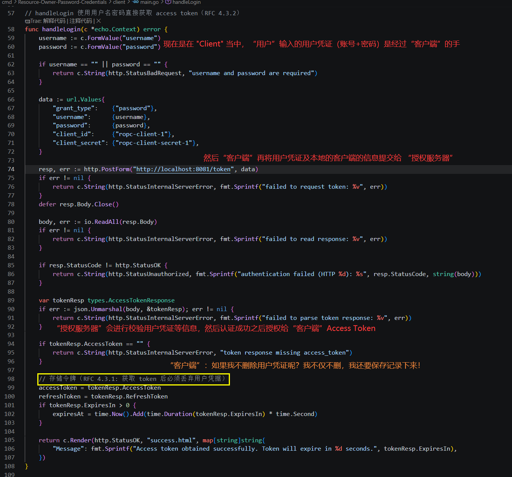

当然 `Resource Owner Password Credentials` 还有问题：它依赖于“客户端”实现用户名和密码登录，然后将用户凭证等信息转发到“授权服务器”上，现代的认证场景的短信登录或者人脸登录，或者采用拖块验证，如果“授权服务器”采用这些，那么这些用户凭证还是“客户端”完成吗？如果让“客户端”承担了这些获取认证逻辑，那么这些“客户端”的开发者需要完成这个极其复杂的安全责任，完成的程度也是各式各样的，就是，这样的设计在认证逻辑改变后，会变得非常复杂。

还有一个问题，如果你是一个 harker，那么你肯定想要让你在攻击别人之后，然后让别人找不到是谁发生了攻击，一般就是代理，或者拿别人的机器完成攻击；如果harker 从采用的是密码模式的“客户端”当中发起进攻，那么在“授权服务器”进行溯源时，只能看到这个“客户端”发起了攻击，这里的“客户端”就成了 hacker 的代理，如果需要继续溯源，那么还要和“客户端”的维护者进行沟通，那么无法进行有效的安全审计和溯源。

> 4.3.1. Authorization Request and Response : The method through which the client obtains the resource owner  credentials is beyond the scope of this specification.  The client MUST discard the credentials once an access token has been obtained.

### Client Credentials

Client Credentials 是 OAuth 框架里的特殊存在，它的核心是将“客户端”作为“用户”来看待，“客户端”就是资源的拥有者，“客户端”在请求“资源服务器”，访问“资源服务器”控制下的受保护资源时，可使用“客户端”的客户端凭据来申请 Token。

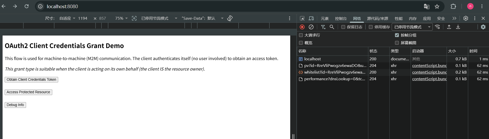
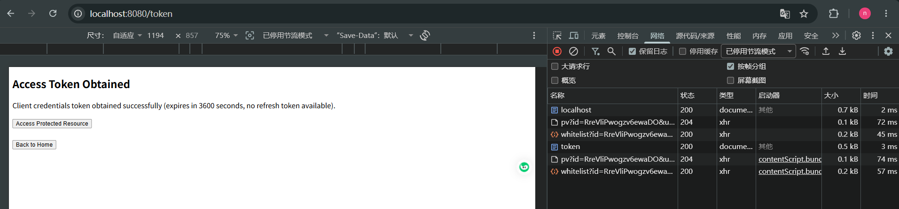
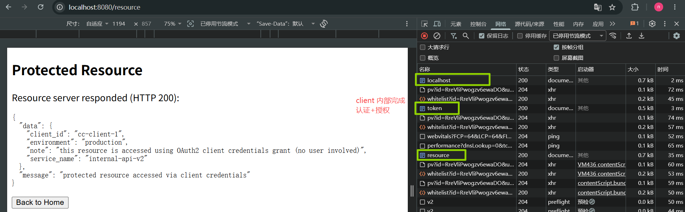

M2M（机器到机器）非常像微服务当中的 RPC 当中的，复用 OAuth 现成的 token 基础设施，但是我感觉它只是为了补充一个在原来只有用户和机器的交互，补充一个机器和机器的交互，没有泄露用户凭证给客户端，因为客户端之间就是资源的拥有者，并且它确实是通过令牌完成调用资源服务的。

#### Client password

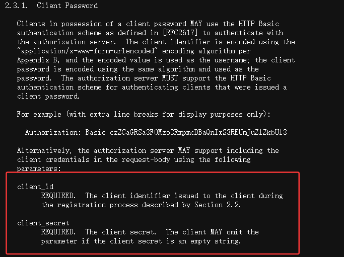
Client Password 在 RFC6749 当中和 Client Credentials 当中使用 Client Authentication 的就是 base64(client_id:client_secret)，

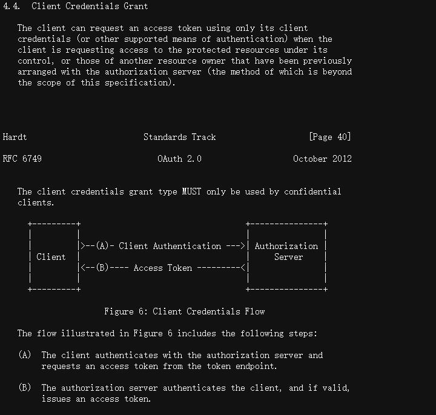
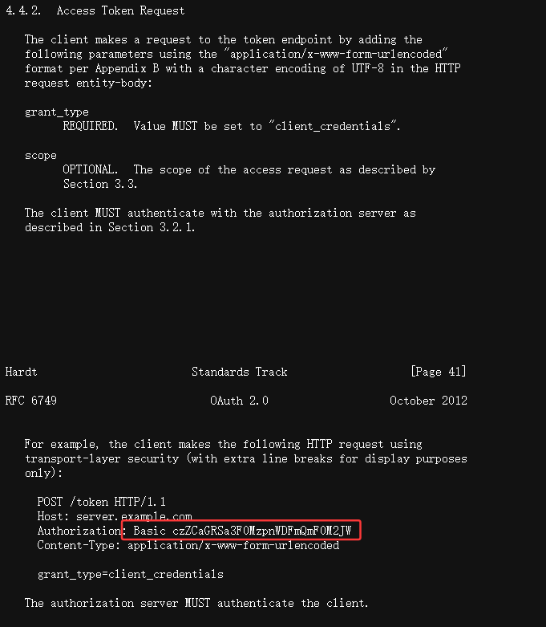

```python
>>> import base64
>>> base64.b64decode("czZCaGRSa3F0MzpnWDFmQmF0M2JW")
>>> b's6BhdRkqt3:gX1fBat3bV'
```

那么这个 client_id 和 client_secret 是如何来的？如果主要观察，你会发现 4 个授权模式（Authorization Code、Implicit、Resource Owner Password Credentials、Client  Credentials）都是需要使用 client_id 或 client_secret（或者两个一起） 的：

1. 在 Authorization Code 当中先发 client_id 得到 Code，然后在用 Code 换 token 时构造 base64(client_id:client_secret)，也就是使用 client_id+client_secret。
2. 在 Implicit 当中只用 client_id，完全不用 client_secret，因为 Implicit 是纯浏览器流程，client_secret 没法安全地存在浏览器里，只需要在输入完用户凭据之后从重定向的  URL fragment 里返回 access token。（~~既然都知道浏览器存 client_secret 不安全，那么还存 access token？~~）
3. 在 Resource Owner Password Credentials 当中，在客户端提交用户凭证时，会将 client_secret 和 client_id 一同发送给授权服务器。
4. 在 Client Credentials，因为没有用户参与，只有 client 自己。如果不用 client_secret 认证，谁都冒充 client 去拿 token，所以需要 client_secret 作为身份凭证。

而 client_id + client_secret 是给谁看的？给 “授权服务器” 的，“授权服务器”肯定要能认识 client_id + client_secret 的话，那么很容易就能想到需要先到 “授权服务器” 当中进行注册。

## OAuth 设计出来的作用是什么？

### OAuth1.0 Introduction

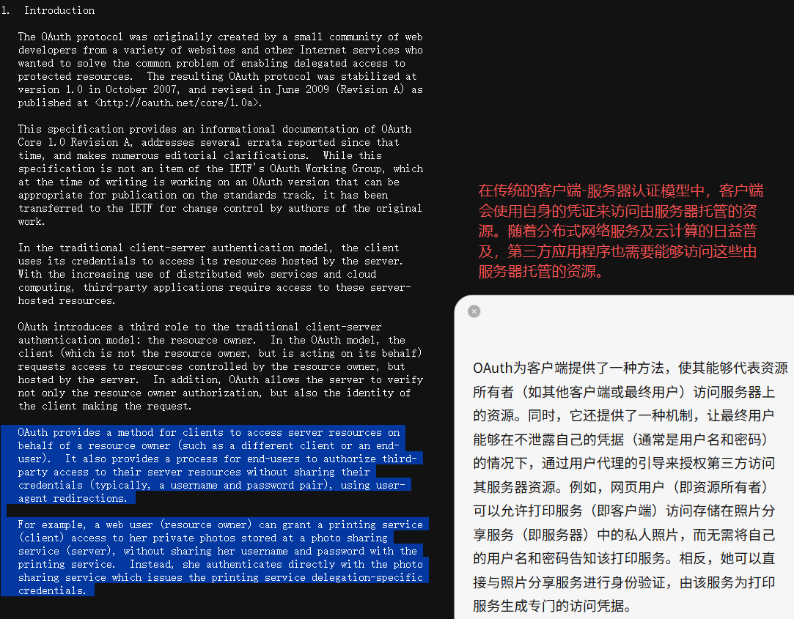

**随着分布式Web服务和云计算的广泛应用，第三方应用程序需要访问这些由服务器托管的资源。**这个就是这个框架的背景，那么知道这个有什么作用，它给出了一个思考方向让你能想到有 OAuth 这个框架，剩下的就是思考自己的产品是否需要需要对外提供服务、或者需要接入外部服务时，搞清除自己是“客户端”使用外部服务的一方，还是“授权服务器”+“资源服务器” 提供服务的一方。

> In the traditional client-server authentication model, the client uses its credentials to access its resources hosted by the server. With the increasing use of distributed web services and cloud computing, third-party applications require access to these server-hosted resources.

### OAuth2.0 Introduction

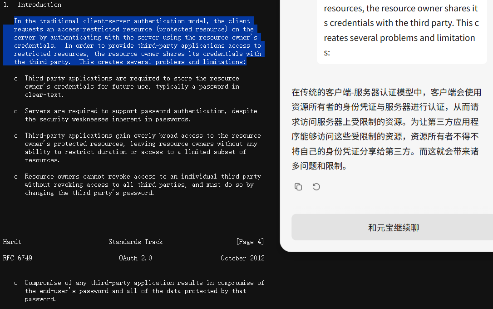

1. 第三方应用必须明文存储用户的密码。（OAuth 用 Token 替代了密码，客户端根本不存密码）。
2. 服务器必须支持密码认证。（OAuth 把认证集中到了授权服务器，资源服务器只需要认 Token）。
3. 第三方应用获得过度访问权限，用户无法限制范围和时长。（OAuth 的 Token 可以限制 Scope 和过期时间）。
4. 用户想收回某个应用的权限，只能改密码，导致所有应用同时失效。（OAuth 支持单独撤销某个 Token，不影响其他应用）。  
5. 任何一个第三方被黑，用户的密码和所有数据都完蛋。（OAuth 下，第三方被黑只泄露有限的 Token，密码依然安全）。

### OAuth 解决的问题

让第三方应用代你访问你的数据，但你不用把密码给它。
在互联网上建立一套令牌（Token）体系，取代密码（Password）在第三方授权场景中的使用。

## 现代的 OAuth （RFC 9700）

其实前面已经穿插提及了 RFC 9700，而 RFC 9700 为什么被提出来呢？

从 April 2010 提出的  通过复杂的加密签名来保证请求安全但是因为这种机制对开发者而言过于复杂，被认为难以使用，从而改进到 October 2012 更新的  到的 2026 年，10 多年了，互联网发展变化也大，January 2025 公布的  进一步为在日益复杂的网络世界中，的用户和开发者提供更安全、更便捷的授权体验。

反正技术就是这样的，要么就是在原有基础上进行缝缝补补，要么就是推翻重来，发明创造一个新的技术实现，或者加一层封装，将原来的多个技术整合到一起换一个叫法，或者将原来没有规范化的东西进行规范化。

RFC 9700（OAuth 2.0 安全最佳实践）的提出本质也是这样的，不好用那就加，加了也没用那就丢，整合借鉴一下成新的。

### 加了也没用那就丢:Implicit 和 Resource Owner Password Credentials 建议移除

前面介绍的 隐式模式（Implicit）和 密码模式（Resource Owner Password Credentials）在 RFC 9700 中表现：

1. 隐式模式（Implicit）：虽然给了 PKCE 作为补丁，但 Token 直接暴露在浏览器 URL 的物理缺陷无法修复。社区观察了几年，发现补丁无效，于是在 RFC9700 中直接宣告 “SHOULD NOT”，在 OAuth 2.1 中直接移除。因为直接将访问令牌返回给用户代理（如浏览器），容易通过浏览器历史记录、Referer 头等方式泄露，被认为是不安全的。
2. 密码模式（Resource Owner Password Credentials）：无论怎么加“加密传输”的补丁，都无法改变“密码明文经过第三方客户端”的致命伤。于是官方直接判了 “MUST NOT”，要求客户端直接处理用户的密码，这本身也违背了 OAuth 的初衷，并将过多责任和风险转移给了客户端。

> 感兴趣可以去看看现在拟定的 OAuth 2.1​​ 的官方规范草案 https://datatracker.ietf.org/doc/draft-ietf-oauth-v2-1/ 的跟踪，目标是在 ​​2026年12月前​​ 提交给IESG（互联网工程指导小组）进行最终批准，我们可以期待一下，但是看样子不会大改，算是在原本的基础上的巩固和增强。

### 不好用那就加:PKCE

值得注意这个概念，因为在 OAuth 2.1​​ 的草案当中 PKCE 成为强制性要求，那么什么是 PKCE？坚信一个概念：“任何你没听说过的东西，要么它本身就不存在，要么就是明明白白写在了某个地方，只是你没去问写在哪里了？”


PKCE 的核心机制：在发 Code 之前先设一个只有客户端知道的密码（code_verifier），换 Token 时必须出示这个密码，Code 被拦截了也没用。

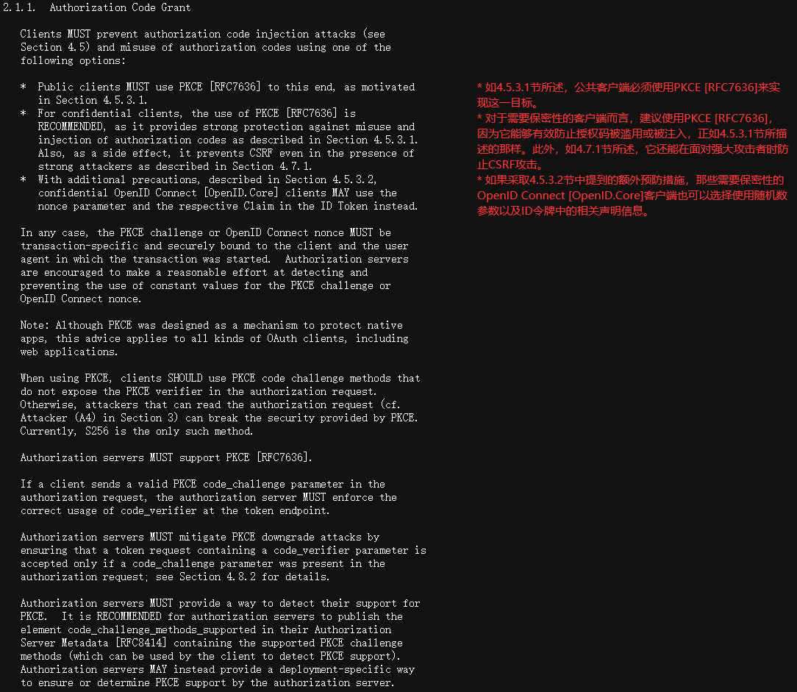

PKCE（Proof Key for Code Exchange，RFC 7636）是授权码模式的增强扩展，用于**防止授权码拦截攻击**。客户端在授权请求中发送 `code_challenge`，在令牌交换时发送 `code_verifier`，授权服务器验证二者匹配后才签发令牌。即使攻击者截获了授权码，没有 `code_verifier` 也无法换取令牌。虽然 PKCE 最初是为原生应用（Public Client）设计，但 RFC9700 建议所有 OAuth 客户端都使用 PKCE，包括 Web 应用。

#### 授权码注入攻击

```bash
# 1. 访问“客户端”页面
curl -c cookies.txt 'http://localhost:8080/'
# 2. 用户在“客户端”进行 OAuth
curl -b cookies.txt -c cookies.txt 'http://localhost:8080/login'
# 3. “客户端”将用户重定向到“授权服务器”登录页面
# > response_type=code: "客户端"向"授权服务器"标识授权模式为 Authorization Code, "授权服务器"根据 response_type=code 路由到 授权码模式 的授权模式处理
# > client_id=oauth-client-1: 标识客户端应用的身份, "客户端"的开发者需要先在"授权服务器"进行注册, 并且注册时还会填写 client_secert , "授权服务器"会使用 client_id + client_secert 作为客户端的凭证
# > redirect_uri=http://<客户端端>/callback : 指定授权码发往的回调地址。需要"授权服务器"将其与"客户端"进行绑定,现在常见的也是在"客户端"在"授权服务器"上注册客户端的凭证时,也要填写 redirect_uri, 因为如果这个被 hacker 篡改了,那么 hacker 可将在回调 Code 时发给自己的钓鱼网站, 从而获取授权码.
# > state=<生成的随机值>: 客户端生成的随机值，需要服务器原样返回。主要是防御 CSRF, 识别者是"客户端", 用于在"客户端"辨识“发起回调的浏览器”是否等于“发起授权请求的浏览器”（即检验是否是同一个人、同一个会话）。
curl -b cookies.txt -c cookies.txt  'http://localhost:8081/authorize?response_type=code&client_id=oauth-client-1&redirect_uri=http%3A%2F%2Flocalhost%3A8080%2Fcallback&state=bb9cc44e032a50e2f80e72e98d69d26b'  
# 4. 用户将用户凭证提交到“授权服务器”
# > response_type 和 client_id 和 redirect_url 和 state 的值都是和前面的重定义一样的参数含义也是一样的
# > username 和 password : 组成用户凭证, 
# > approve=yes : 用户明确同意授权（“同意”按钮）;若"授权服务器"支持自动同意（prompt=none），攻击者可跳过此步，甚至利用 CSRF 让受害者无感知地授权（见 RFC 9700 4.11.2 节）。
# 因为"授权服务器"为了让用户有更好的体验, 所以会在用户完成认证之后, 让浏览器记住一个 cookie, 当用户使用同一个浏览器访问时, 如果浏览器能正确给出对应有效的 cookie, 那么就不需要用户输入密码, 然后还支持 prompt=none, 那么就会直接造成 CSRF 让 hacker 直接利用用户在浏览器的 cookie 去完成伪造用户发送 request  
curl -b cookies.txt -c cookies.txt -X POST  'http://localhost:8081/authorize?response_type=code&client_id=oauth-client-1&redirect_uri=http%3A%2F%2Flocalhost%3A8080%2Fcallback&state=bb9cc44e032a50e2f80e72e98d69d26b'    --data-raw 'username=limit1&password=admin%40123&approve=yes'
---
# 5. “授权服务器”将用户重定向到“客户端”
# > code=<一次性临时授权码> : 授权服务器颁发的一次性授权码。
# > state=<客户端给出的随机值> : 如果存在需要"授权服务器"能原样回传
# 这里的 state 的生成者是"客户端", 在前面讲了通过 state 防止 hacker 使用 CSRF 将 hacker 的 Code 换来的 Access Token，绑定到了受害者的“客户端”上的触发流程，就是通过校验这个 state 是否必定是通过的“客户端”完成参数的构造。
curl -b cookies.txt -c cookies.txt  'http://localhost:8080/callback?code=5ebb4e076b00577e86c43e428e73d8db&state=bb9cc44e032a50e2f80e72e98d69d26b'   
# 6. 用户得到“客户端”访问的资源
curl -b cookies.txt -c cookies.txt 'http://localhost:8080/resource'  
```

其中第五步的“授权服务器”将用户重定向到“客户端”的 callback?code=<授权码>&state=<临时客户端标识>，就是授权码注入攻击的“注入点”，在前面的 1-4 步骤都是不变的，用户和 hacker 都完成前四步，最终得到一个 code 
[下面是在 hacker 的浏览器当中完成的]
```shell
curl -b cookies.txt -c cookies.txt  'http://localhost:8080/callback?code=<用户的Code>&state=<"客户端"生成的状态字符串1>'  

curl -b cookies_H.txt -c cookies_H.txt  'http://localhost:8080/callback?code=<hacker的Code>&state=<"客户端"生成的状态字符串2>'  
```

这里只需要让 hacker 将原先的用户的 Code 变为 hacker的Code，这样客户端拿着 hacker的Code 去换 Access Token，而用户“客户端”得到的 Access Token 是到“资源服务器”上的 resource 获取特定的 hacker 信息，达到与前面的 CSRF 一样的效果。

[这个操作在 用户 的浏览器当中完成]
```shell
curl -b cookies.txt -c cookies.txt  'http://localhost:8080/callback?code=<hacker的Code>&state=<"客户端"生成的状态字符串1>'  
```

描述一下攻击原理​​：
​​1. 获取授权码​​：攻击者通过某种方式（如网络嗅探、不安全的重定向URI、恶意脚本插件等）窃取到用户授权成功后返回的授权码。
​​2. 发起合法会话​​：攻击者从自己的设备上启动一个正常的OAuth流程，与合法的客户端建立会话（这里可以也能先完成）。
​3. ​替换授权码​​：在授权服务器返回授权码的步骤中，攻击者拦截并篡改响应，将原本的授权码替换为之前窃取的授权码。
4. ​​客户端兑换令牌​​：客户端使用被注入的授权码向授权服务器请求访问令牌。由于授权码是有效的，授权服务器会颁发对应的访问令牌。
​​5. 攻击成功​​：攻击者通过自己的会话获得了受害者的资源访问权限，实现了身份冒充或资源越权访问。

1. 那么这里的 state=<"客户端"生成的状态字符串1> 不能帮忙吗？确实帮不上， state 的核心设计目标是防御 CSRF，它校验的是发起回调的浏览器，是不是当初发起授权请求的那个浏览器。
2. 那么 Code 没有绑定用户吗？确实绑定了，并且绑定将用户和客户端都绑定在了一起，那么后端只需要校验一下当前会话的 Username 和 Code 绑定的 Username 是不是一起的不就行了？会话在“客户端”，username 和 Code 的绑定关系只要 “授权服务器” 知道：
    - “客户端”没法在用 Code 换 Access Token 之前问“授权服务器”这个 Code 是谁的，因为授权服务器没有提供一个公开接口让客户端在换 Token 前去查询这个 Code 对应是哪个用户，没有定义或者没有去考虑这个情况。
    - “客户端”的当前会话没有 code 关联的 username，也就是它只是拿着这个 Code 和自己的 client_id 和 client_secert 和 redirect_uri 去所要 Access Token。
    - "授权服务器"也没有办法考虑 Code 使用的“客户端”背后的用户是谁。 

那么 RFC9700 就提供了一个解决办法使用 PKCE 在 “客户端” 与 “授权服务器” 进行了一个绑定，让 "授权服务器" 可以将 Code 与 “客户端” 背后的用户代理（浏览器/设备）实例进行绑定。  

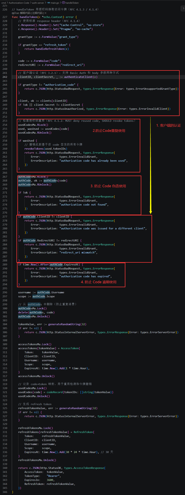

#### PKCE 的加入

出问题的地方是 auth-server 和 client；那么主要修改 client 和 auth-server 的实现。

[表象]

1. 在 **3. “客户端”将用户重定向到“授权服务器”登录页面** 时，将同时携带两个新的参数 code_challenge 和 code_challenge_method。

```shell
# 原本的没有启用 PKCE
curl -b cookies.txt -c cookies.txt  'http://localhost:8081/authorize?response_type=code&client_id=oauth-client-1&redirect_uri=http%3A%2F%2Flocalhost%3A8080%2Fcallback&state=bb9cc44e032a50e2f80e72e98d69d26b'
# 启用 PKCE
curl -b cookies.txt -c cookies.txt  'http://localhost:8081/authorize?response_type=code&client_id=oauth-client-1&redirect_uri=http%3A%2F%2Flocalhost%3A8080%2Fcallback&state=bb9cc44e032a50e2f80e72e98d69d26b&code_challenge=VuHlpQeYewwMJZe7wYa8kEPlEVML2mB5iv14XaFJiQU&code_challenge_method=S256'  
```

2. 在 **4. 用户将用户凭证提交到“授权服务器”** 时，将也会将这两新的参数 code_challenge 和 code_challenge_method  提交到 authorize 节点

```shell
# 无 PKCE
curl -b cookies.txt -c cookies.txt -X POST  'http://localhost:8081/authorize?response_type=code&client_id=oauth-client-1&redirect_uri=http%3A%2F%2Flocalhost%3A8080%2Fcallback&state=bb9cc44e032a50e2f80e72e98d69d26b'    --data-raw 'username=limit1&password=admin%40123&approve=yes'
# 使用 PKCE
curl -b cookies.txt -c cookies.txt -X POST  'http://localhost:8081/authorize?response_type=code&client_id=oauth-client-1&redirect_uri=http%3A%2F%2Flocalhost%3A8080%2Fcallback&state=bb9cc44e032a50e2f80e72e98d69d26b&code_challenge=VuHlpQeYewwMJZe7wYa8kEPlEVML2mB5iv14XaFJiQU&code_challenge_method=S256'   --data-raw 'username=limit1&password=admin%40123&approve=yes'
```

那么在 auth-server 和 client 内部当中到底发生了什么？


[内部]

1. code_challenge 和 code_challenge_method 怎么来的？

- code_challenge = BASE64URL-ENCODE(SHA256(ASCII(code_verifier)))
- code_challenge_method= S256 ，其中的 S256 表示 code_verifier 是通过 SHA-256 哈希 + Base64URL 编码

2. 那么 code_verifier 又是哪里来的？

- 使用 “32 字节随机数”进行 “base64url 编码”最后得到 “43 字符”，按照base64 的算法逻辑，产生的 base64 的结果长度满足 `len = 4 * ceil(字节数 / 3)` ，也就是 32/3 进行向上取整为 11 ，然后 11*4 为 44，但是因为是通过 base64url 所以会将结尾的 "=" 进行删减。 

> Base64就是一个算法的名字，它把每 3 个字节（3*8 = 24 位）重新拆分成 4 个 6 位数字表示（4 * 6 == 3 * 8 == 24），然后查表转换成 4 个可打印字符。
> 为什么叫做 Base64 实际就是 Base64 使用固定的 64 个字符作为“码表”，也就是它所查的表的是从 64 个 Ascii 字符构成的
> 而这里的 base64url 其实是 base64 的一种特殊形式，将原本 “码表” 当中的 "+" 和 "/" 替换成 "-" 和 "_"，但是计算流程完全一样，并且 Base64URL 通常会去掉 base64 末尾的填充符 "="。
> 小 Tips: 2**6 == 64 ，你能联想到什么（一个 6 位二进制可以表示 0-63 个不同的结果） 😮

3. code_challenge 和 code_challenge_method 和 code_verifier 是如果工作的？

- 在 client 当中想要去到 authserver 当中进行登录时，实际是通过范围 client 当中的 /login 节点进行重定向到 authserver 的 /authorize 节点的，也就是上面的表象1（浏览器是通过重定向的），这个时候就将 client 采用 PKCE 进行 OAuth2.0 授权码模式安全增强的两个新的参数 code_challenge 和 code_challenge_method 可以告知 authserver 了。
- 而在 client 的内部，会先生成 code_verifier ，然后存储记录下 code_verifier，之后将 code_verofier 代入 code_challenge = BASE64URL-ENCODE(SHA256(ASCII(code_verifier))) 当中得到 code_challenge，而这里的 code_challenge_method 就是 SHA256
- 再在 authserver 的内部的 /authorize 节点内部，用户将自己的登录凭证提交到 authserver 的 /authorize 时，也就是表象2，内部会将生成的 code 与 code_challenge 进行绑定，也就是知道 authserver 签发的 code 是和哪个 code_challenge 产生关联捆绑的，然后利用 code= 参数，把生成的 code 重定向到 client 的 /callback 节点。
- 在 client 的 /callback 节点内部，它会用授权码 code  + PKCE 的 code_verifier 向授权服务器换取访问令牌，因为“在 client 生成 code_verifier 后，存储记录下 code_verifier 在 client 当中”，然后将这个 code 和 code_verifier 提交到 authserver 的 /token 节点。
- 我们已经知道 “auth 内部会将生成的 code 与 code_challenge 进行绑定”，然后 “code_challenge = BASE64URL-ENCODE(SHA256(ASCII(code_verifier)))” 这个关系，那么在 authserver 的 /token 节点内部当中根据 client 给出的授权码 code， 去找到 code 绑定的 code_challenge，然后再通过共同提交到 /token 的 code_verifier 计算出 code_challenge，最后比对一下计算出来的 code_challenge 和原先 code 绑定记录的 code_challenge 是不是一样的，那么就实现了让 "授权服务器" 可以将 Code 与 “客户端” 背后的用户代理（浏览器/设备）实例进行绑定的方案。

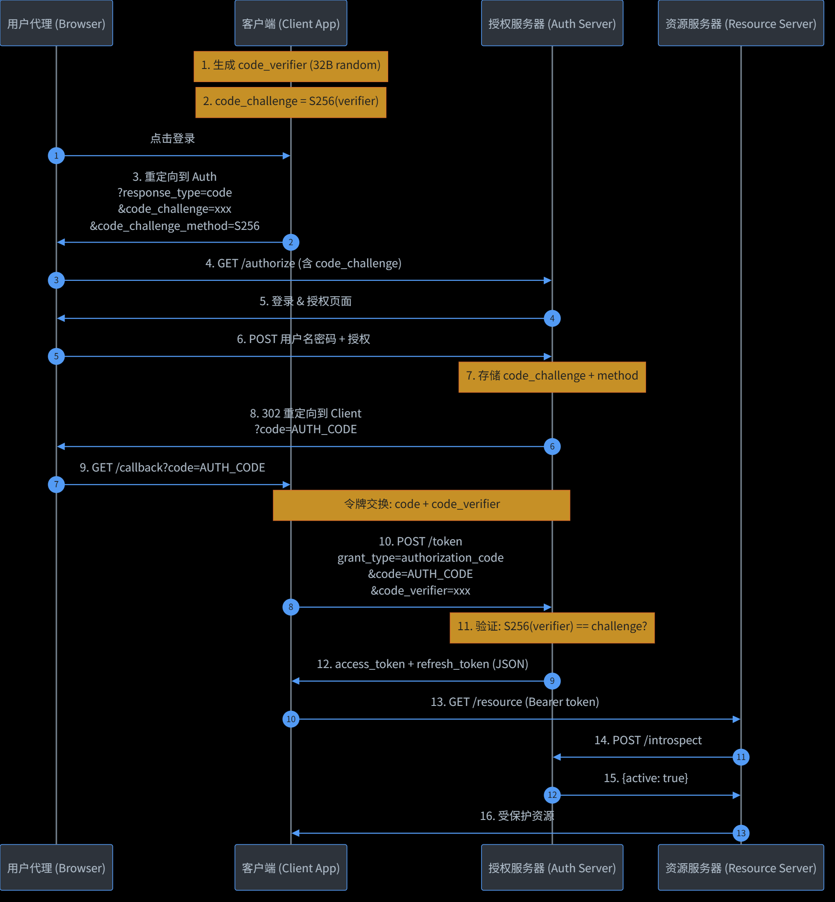

#### 总结

1. 传统 OAuth 2.0 的绑定是通过 Code 主要绑定 client_id/redirect_uri/username；但所有合法用户用的都是同一个 client_id，也就是大家都能用这个 client 并且所有合法用户回调地址都一样，虽然在 authserver 完成了 username 与 code 是绑定，但是无法知道使用 client 的用户到底是谁，也就是无法区分不同的“人/浏览器”。
2. 而 PKCE 的绑定通过 code_challenge 对 Code 进行增强，将 code 绑定 code_challenge，其实可以把这个 code_challenge 看着是 code_verifier 的哈希，而 code_verifier 是用户的 client 的的内存里生成的，且从未经前端传输，那么这个 code_verifier 其实就是用于表示这个用户的 client，那么在 authserver 当中 code 又会和 code_challenge 进行绑定，这个时候也是间接将 code->code_challenge->code_verifier->用户的客户端进行了动态绑定，这个 Code 只认 “生成 code_verifier 的那个特定浏览器实例”。


## 实操

协议是这样规定的，但是一定要这么实现吗？

我们采用github 进行 OAuth2.0，首先注册一个 client 在 auth-server 当中 ，必填项为 “Application name” 和 “Homepage URL” 和 “Authorization callback URL”，

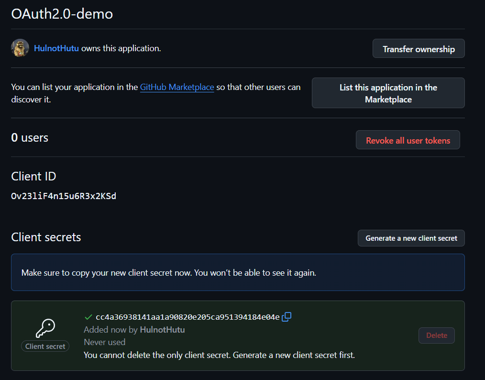

client-id=Ov23liF4n15u6R3x2KSd
client-secret=cc4a36938141aa1a90820e205ca951394184e04e 这里需要输入自己的 github 的密码进行二次确认。

有了这些之后，我们就能修改客户端的代码了，首先就是 auth-server 的 /authorize 节点的替换。
参考 

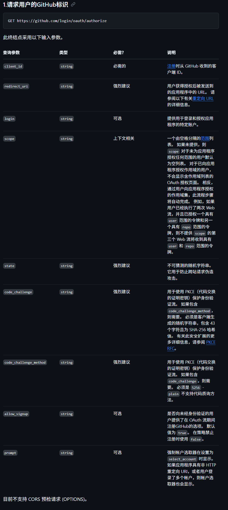

1. 其中 client_id 是必须，redirect_uri 采用我们注册时填写的 http://localhost:8080/callback，然后 state 采用随机即可，还 scope，这个是用于在 auth-server 的 access-token 的凭据签发的 token 当中的标记 access-token 可访问的 resource-server 当中的资源的“范围”，可以看作是访问权限，默认是"授予对公共信息（包括用户个人资料信息、仓库信息和 gist）的只读权限"，然后 重定向到 github.com 的认证节点 /login/oauth/authorize。

> 可以根据自己的 client 实际所需访问资源的不同使用不同的 scope 

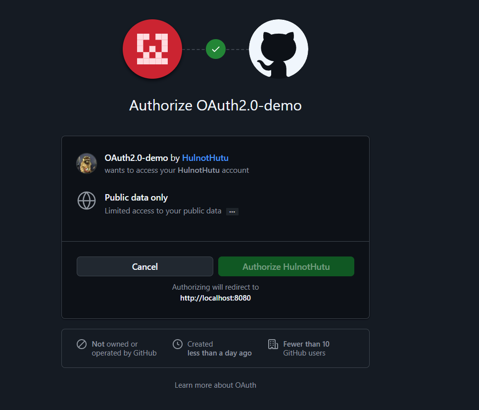

2. 再将请求 AccessToken 的节点替换为 github.com 这个认证服务器的 /login/oauth/access_token 节点，这里按需设置 Accept 请求头来控制认证服务器返回的请求体格式，具体参考 [users-are-redirected-back-to-your-site-by-github](https://docs.github.com/zh/apps/oauth-apps/building-oauth-apps/authorizing-oauth-apps#2-users-are-redirected-back-to-your-site-by-github)

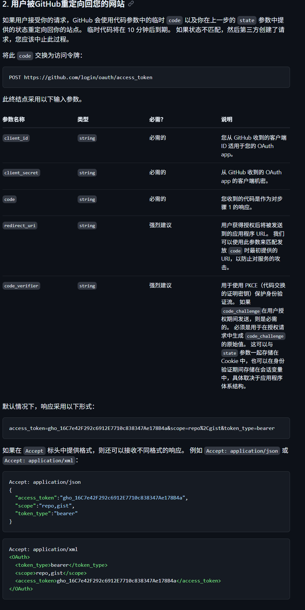

3. 我们可以通过 Auth-server 的 callback 获取的 AccessToken 的去访问 https://api.github.com/user 节点获取信息，获取的信息的 API 文档参照 https://docs.github.com/zh/rest/users/users?apiVersion=2026-03-10  


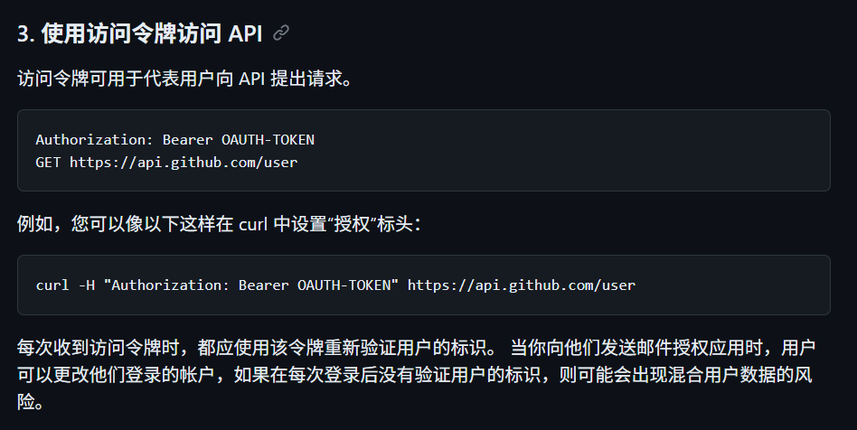

我们就能在自己的 client 的那种获取到自己 github 上的资源节点当中的信息，稍微写个页面展示。

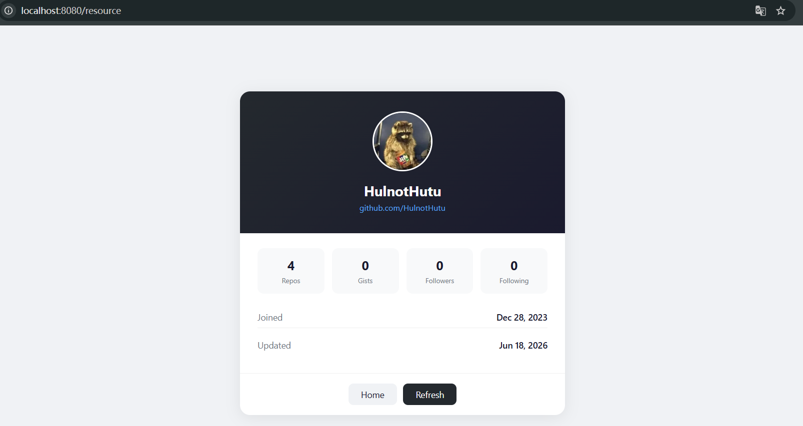

## 总结

RFC 6749 为OAuth 2.0 授权框架，定义了资源所有者、资源服务器、客户端、授权服务器四种角色，以及四种授权模式（Authorization Code、Implicit、Resource Owner Password Credentials、Client Credentials），并且引入 Access Token 和 Refresh Token 机制，RFC 9700 是 2025 年 1 月发布的，明确弃用了 Implicit Grant 和 Resource Owner Password Credentials Grant，强制要求所有客户端（包括 Web 应用）使用 PKCE，强调精确 Redirect URI 匹配和 Sender-constrained Access Token，系统梳理了授权码注入、CSRF、Mix-Up 等攻击的防护方案，

https://github.com/HulnotHutu/oauth2-study

## 所以 OAuth2.0 到底有什么作用？

首先 OAuth2.0 这个技术有什么特点？让一个应用（客户端）能够在用户（资源所有者）不泄露密码的前提下，安全地、有限度地访问用户存放在另一个服务（资源服务器）上的数据。

1. OAuth 2.0 解决的是“我能访问什么”的问题，而不是“我是谁”的问题；OAuth 2.0 本身只负责下发那把能打开资源大门的 Token
2. 引入了授权服务器作为独立中介，将用户、客户端和资源服务器彻底分离。
3. 访问权限被拆解为“范围”和“生命周期”。

你会发现它的描述和**“解耦”**这个词语高度相关，那么并且它采用 Token 作为各个角色当之间进行传递，那么这样特性让它在微服务当中有了很好的发挥。
在微服务架构中，认证授权的设计不便于使用 “登录” -> “存 Session” 的方式，因为一个服务抽象被拆分为多个服务实例（集群），除非实现“分布式 Session 机制”，不然很影响用户的体验，用户使用一个微服务的服务，然后可能被网关转发到多个不同的服务实例上，传统的 Session 保证在服务器内部的内存当中，这迫使我们将认证（Authentication）与授权（Authorization）解耦，将 Token 作为身份凭证在请求链路中传递，而 JWT（Token） 无状态、自包含、跨域的特点就成为微服务环境下的首选。
现代微服务认证体系不是选择某种单一方案，而在于组合多种机制，在安全性与可用性之间取得平衡，也会结合当前主流的登录鉴权方式 Session + Cookie （适合单体应用），虽然管理方便且但是可主动失效，但难以水平扩展；需要合理将根据业务场景的不同使用不同的鉴权方式 Cookie/Session/Token，将“获取用户授权”与“获取访问令牌”解耦，从而显著缩小了凭证的暴露面，但 Token 一旦签发，在过期前始终有效，无法因用户修改密码、权限变更或异常登出而立即失效，
JWT 是 Token 方案的一种实现，在微服务架构中，若每个服务都对每次请求远程调用授权服务器进行 Token 校验，会带来性能瓶颈和单点依赖，所以通常在每个服务缓存授权服务器的 JWKS（公钥集），然后定时刷新，在本地完成 JWT 签名校验与过期检查，从而消除网络往返开销。

> 架构上，Gateway 可作为统一的认证入口，负责 Token 解析与用户信息提取，并与添加 Request Header 的方式将身份信息传递给下游服务，而下游服务则进行独立校验 Token 签名，检查请求是否来自 Gateway 的转发。
> 但“Token 签发后无法主动失效”的先天缺陷，需要通过短过期时间、Refresh Token 或版本号机制加以弥补，或者将 Token 存入 Redis 当中，将 Token 退化为 Session，还是要看具体的业务场景。
> 工程上，主流的解决方案是在 JWT Payload 中嵌入 jti（唯一标识）与 token_version，并在每次关键操作（如密码修改、权限变更）时更新数据库或缓存中的版本号，中间件在每次校验时将该版本号与当前请求中的版本号进行比对，从而实现可控失效。
> 对于 Refresh Token，则需引入 Rotation + Reuse Detection 机制，使得每次刷新时签发新的 Refresh Token 并使旧 Token 失效，然后若旧 Token 出现再次使用，则说明已泄露，立即撤销该用户下所有活动 Token，强制重新认证。
